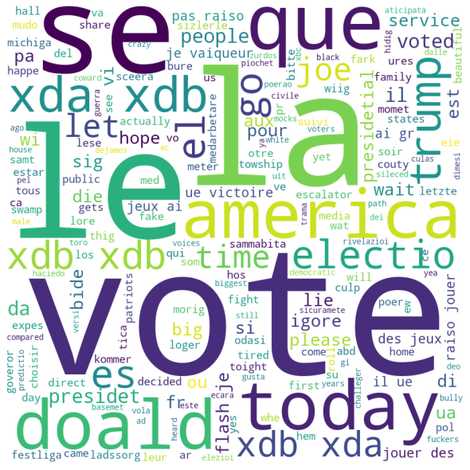

<script type="text/javascript"
        src="https://cdnjs.cloudflare.com/ajax/libs/mathjax/2.7.0/MathJax.js?config=TeX-AMS_CHTML"></script>

```python
# importing
import pandas as pd
import numpy as np
import bz2
import nltk
import torch
import torchtext
import gensim
```

# Document Feature Extraction, Text Processing, and Word Embedding
## Requirements
- Introduce scikit-learn, nltk, and other text processing libraries
- Explain basic feature extraction from text data
    - Number of words
    - Number of characters
    - Average word length
    - Number of stopwords
    - Other feature extraction techniques that may be relevant
- Explan advanced text processing
    - N-grams
    - Term Frequency (TF)
    - Inverse Document Frequency (IDF)
    - Term Frequency-Inverse Document Frequency (TF-IDF)
    - "Bag of Words" document representation
    - Word embedding
    - Other text processing methods that may be important

# Document Feature Extraction
## TF/IDF
Term Frequency (TF) and Inverse Document Frequency (IDF) are useful data that will inform us as to which terms are the most relevant to a given document in a corpus. TF simply measures the frequency of a given word in a document. This measurement is useful because typically, common words are relevant to the meaning of that document. TF can be calculated in the following way:

\\(TF = OC / T\\)

$OC$ is the total number of occurences of that particular word in the document and $T$ is the total number of words in the document. Suppose we have access to all of the articles on Wikipedia. Our corpus, in this context, is all of these Wikipedia articles combined. Each of these articles would be its own entity called a document. Document Frequency (DF) is a measure of how frequently a given word appears in the entire corpus of text. The IDF is the inverst of the DF:

$IDF = \frac{1}{DF}$

Using the TF and the IDF we can measure how important and unique a given word is for a particular document. Since word frequencies are distributed exponentially, we use the log of the IDF to obtain a measure for the value of a word in a given document:

Word Value (WV) $= TF \cdot log(IDF)$

This approach treats the documents in a corpus as a "bag of words". This means that this approach does not take into account the meaning of sentences or the contexts in which these words are used in. This restricts the applications of this method severely. 

### TF/IDF Application
Suppose we wish to search our Wikipedia corpus for a document most relevant to Serena Williams. We could compute the WV for "Serena Williams" accross all of the documents. Then, we could the set of documents that had the highest "Serena Williams" WVs. This would be a reasonably effective way to query a corpus for relevant documents. 

# N-Gram Models
N-Gram models are very useful models in the field of text analysis. An N-Gram model can predict the probability of a word occurring based on the occurrence of the N-1 words preceding it. These models have a tremendous amount of use cases. They can be used to determine which word belongs in a particular sentence for the purpose of text generation. They can be used to detect spelling errors in sentences. They can also be used as speech recognition engines. 

We will illustrate a simple example of how an N-Gram model can be used to detect a spelling error. Suppose we are given the following set of sentences:


```python
sentence = "Today I went to the store. Yesterday it took me 10 minutes to drive there. Today, it took me 15 minutes to get there and 15 minuets to get back."
```

"minutes" was spelled as "minuets" in the third sentence. If we implement a simple bi-gram (2-gram) model on this corpus, we can compute the probability of each word appearing as a function of the word appearing immediately before that word. The following snippet tokenizes the above sentence and computes the bi-gram frequencies:


```python
tree_bank_tokenizer = nltk.tokenize.TreebankWordTokenizer()
wnlemmatizer = nltk.stem.WordNetLemmatizer()
words = tree_bank_tokenizer.tokenize(sentence)
words = [wnlemmatizer.lemmatize(word) for word in words]
n_grams_series = pd.Series(nltk.ngrams(words, 2))
print(n_grams_series.value_counts())
```

    (minute, to)           2
    (took, me)             2
    (to, get)              2
    (it, took)             2
    (10, minute)           1
    (get, there)           1
    (15, minuet)           1
    (store., Yesterday)    1
    (me, 15)               1
    (Yesterday, it)        1
    (to, drive)            1
    (there., Today)        1
    (me, 10)               1
    (,, it)                1
    (15, minute)           1
    (the, store.)          1
    (to, the)              1
    (there, and)           1
    (minuet, to)           1
    (back, .)              1
    (get, back)            1
    (and, 15)              1
    (Today, I)             1
    (went, to)             1
    (I, went)              1
    (drive, there.)        1
    (Today, ,)             1
    dtype: int64
    

From the snippet above, we can see that the word "minute" appears twice before the word "to". In the original corpus, the word "to" appears 3 times, not including the time when it appeared after "minuets". Therefore, there is a probability of 2/3 that "minuets" should be "minutes" and a probability of 1/3 that it should be "went".

In this simple example a bi-gram model was able to detect a spelling mistake. By using a large corpus we can achieve very effective N-gram models. Further, increasing the model's "N" we can sometimes increase the effectiveness of the model. Increasing "N" can also, however, harm the effectiveness of the model by using irrelevant words to determine the context of a given word. 

# Text Processing for Complex Models
## Why is Text Processing Important?
Natural language processing is a branch of artificial intelligence in which unstructured text data is broken down into information that can be analyzed by models. Especially in the age of social media, humans commuincate online through unstructured text messages all the time. Whether it be through Twitter, private messaging platforms like Facebook Messenger, or through product reviewing interfaces like Yelp. The ability to transform these unstructured blobs of text into forms that are machines can understand opens the door to a wide variety of applications. 

These applications primarily fall under text classification and generative models. Text classification agents try to uncover the intent, logic, and/or meaning behind blobs of text. This model type can be implemented in all sorts of contexts. For example, as an AI that can automatically sort through text reviews to characterize the performance of a fast-food chain. 

Processed text can also be used as an input to generative models. These generative models learn how to commuincate by training on large blobs of processed text. These models can be used to generate speeches or converse with customers, for example.

## Tokenization
When trying to analyze a corpus, some characters, a chain of words, or a set of reviews, we are initially provided with some text. This text may contain spelling errors, they may or may not obey the grammatical rules of the English language, and they may contain punctuation. For our analysis, we will consider Amazon review data. The following code snippets load the Amazon review dataset and display a handful of example reviews:


```python
# loading data
# available: https://www.kaggle.com/bittlingmayer/amazonreviews
train_data_file = bz2.BZ2File("amazon-review-data/train.ft.txt.bz2")
test_data_file = bz2.BZ2File("amazon-review-data/test.ft.txt.bz2")
train_lines = train_data_file.readlines()
test_lines = test_data_file.readlines()
del train_data_file, test_data_file
train_lines = [x.decode('utf-8') for x in train_lines]
test_lines = [x.decode('utf-8') for x in test_lines]
```


```python
# dataset properties
train_lines_len = len(train_lines)
test_lines_len = len(test_lines)
total_length = train_lines_len + test_lines_len
print("Train Lines Length =", train_lines_len)
print("Test Lines Length =", test_lines_len)

total_length = train_lines_len + test_lines_len

print("Length of Total Dataset =", total_length)
print("Percentage of Training Data = {}%".format(round(train_lines_len / total_length * 100, 3)))
print("Percentage of Testing Data = {}%".format(round(test_lines_len / total_length * 100, 3)))


```

    Train Lines Length = 3600000
    Test Lines Length = 400000
    Length of Total Dataset = 4000000
    Percentage of Training Data = 90.0%
    Percentage of Testing Data = 10.0%
    


```python
# amazon review examples
np.random.seed(20)
random_indices = [np.random.randint(100) for x in range(3)]
for index in random_indices:
    print("Amazon Example Review at Index {}".format(index))
    print(train_lines[index][11:])
```

    Amazon Example Review at Index 99
    Caution!: These tracks are not the "original" versions but are re-recorded versions. So, whether the tracks are "remastered" or not is irrelevant.
    
    Amazon Example Review at Index 90
    No instructions included - do not trust seller: Promised with this item are "Complete Instructions" and the additional pledge that "Sweet Graces will email you with the Supply List and Instruction sheets on purchase - so you can be ready ahead of time!" I received none of this - only a plastic figurine and bracelet. To boot, Amazon claims they can do nothing to help me contact the seller. All I got was a phone number for the manufacturer. Let's hope that yields some results. Meanwhile, I'm wishing I had listened to previous feedback about this unreliable seller :/
    
    Amazon Example Review at Index 15
    Don't try to fool us with fake reviews.: It's glaringly obvious that all of the glowing reviews have been written by the same person, perhaps the author herself. They all have the same misspellings and poor sentence structure that is featured in the book. Who made Veronica Haddon think she is an author?
    
    

As shown above, these text reviews contain a few sentences strung together to form a review. These sentences contain punctuation, capital letters, slang, and spelling mistakes. Our goal when processing these blobs of text is to take these unstructured sentences and transform them into a set of tokens that a model can understand. Currently, the model cannot understand the meaning of these sentences.

There are several natural language processing libraries in Python that allow us to create tokens from these unstructured sentences. The way in which we break these sentences apart will determine the effectiveness of the model.

To create tokens, we must first consider the way in which we understand the English language. A sentence is made up of words. These words are separated by spaces. We can tokenize a sentence by splitting up the sentence using white-space as a delimiter. Consider the following text entry:


```python
text_entry_example = train_lines[24][11:]
print(text_entry_example)
```

    i liked this album more then i thought i would: I heard a song or two and thought same o same o,but when i listened to songs like "blue angel","lanna" and 'mama" the hair just rose off my neck.Roy is trully an amazing singer with a talent you don't find much now days.
    
    

### WhitespaceTokenizer
Using the ```nltk.tokenize.WhitespaceTokenizer```, we can separate the above review using white-space as the delimiter:


```python
white_space_tokenizer = nltk.tokenize.WhitespaceTokenizer()
print(white_space_tokenizer.tokenize(text_entry_example))
```

    ['i', 'liked', 'this', 'album', 'more', 'then', 'i', 'thought', 'i', 'would:', 'I', 'heard', 'a', 'song', 'or', 'two', 'and', 'thought', 'same', 'o', 'same', 'o,but', 'when', 'i', 'listened', 'to', 'songs', 'like', '"blue', 'angel","lanna"', 'and', '\'mama"', 'the', 'hair', 'just', 'rose', 'off', 'my', 'neck.Roy', 'is', 'trully', 'an', 'amazing', 'singer', 'with', 'a', 'talent', 'you', "don't", 'find', 'much', 'now', 'days.']
    

The problem with this tokenization method is that tokens like 'would:', 'neck.Roy', '"blue', 'angel"', and 'days.' don't have much meaning. 'would:' and 'would' have different meanings. Further, 'neck.Roy' and 'neck', 'roy' also have different meanings. We need to somehow take into account the puntuation present in each review. Further, we need to factor in capital letters, plural and singular forms of words, and spelling mistakes. Consider another example:


```python
text_entry_example = train_lines[15][11:]
print(text_entry_example)
```

    Don't try to fool us with fake reviews.: It's glaringly obvious that all of the glowing reviews have been written by the same person, perhaps the author herself. They all have the same misspellings and poor sentence structure that is featured in the book. Who made Veronica Haddon think she is an author?
    
    

### WordPunctTokenizer
To take into account the punctuation present in a review, we will try the ```nltk.tokenize.WordPunctTokenizer```:


```python
word_punct_tokenizer = nltk.tokenize.WordPunctTokenizer()
print(word_punct_tokenizer.tokenize(text_entry_example))
```

    ['Don', "'", 't', 'try', 'to', 'fool', 'us', 'with', 'fake', 'reviews', '.:', 'It', "'", 's', 'glaringly', 'obvious', 'that', 'all', 'of', 'the', 'glowing', 'reviews', 'have', 'been', 'written', 'by', 'the', 'same', 'person', ',', 'perhaps', 'the', 'author', 'herself', '.', 'They', 'all', 'have', 'the', 'same', 'misspellings', 'and', 'poor', 'sentence', 'structure', 'that', 'is', 'featured', 'in', 'the', 'book', '.', 'Who', 'made', 'Veronica', 'Haddon', 'think', 'she', 'is', 'an', 'author', '?']
    

From the above output we can see tokens like "t", "s", and "'" are occurring. These tokens have no meaning. 

### TreebankWordTokenizer
To solve this problem we can use a more advanced tokenization method that transforms these types of tokens into tokens that are more meaningful called the ```nltk.tokenize.TreebankWordTokenizer```:


```python
tree_bank_tokenizer = nltk.tokenize.TreebankWordTokenizer()
text_entry_tb_output = tree_bank_tokenizer.tokenize(text_entry_example)
print(text_entry_tb_output)
```

    ['Do', "n't", 'try', 'to', 'fool', 'us', 'with', 'fake', 'reviews.', ':', 'It', "'s", 'glaringly', 'obvious', 'that', 'all', 'of', 'the', 'glowing', 'reviews', 'have', 'been', 'written', 'by', 'the', 'same', 'person', ',', 'perhaps', 'the', 'author', 'herself.', 'They', 'all', 'have', 'the', 'same', 'misspellings', 'and', 'poor', 'sentence', 'structure', 'that', 'is', 'featured', 'in', 'the', 'book.', 'Who', 'made', 'Veronica', 'Haddon', 'think', 'she', 'is', 'an', 'author', '?']
    

"Do" + "n't" converys the meaning of "Don't" better than "Don", "'", "t". The ```TreebankWordTokenizer``` presents the most effective way to extract meaning from these sentences. 

## Token Normalization
Now that we have split our data into tokens, we must further parse these tokens. It may be the case that we want the same token for different forms of a given word. For example, we may want both "pen" and "pens" to be represented by the "pen" token. Moreover, we may want "person", "people", and "persons" to all be represented by "person". There are two ways in which we can concatenate these tokens: stemming and lematization.

### Stemming
Stemming is the process of removing and/or replacing the suffixes of words to obtain the root meaning of the word. This normalization method simply cuts off the suffixes of various words to obtain simplified and understandable tokens. Let's apply the ```nltk.stem.PorterStemmer``` normalization method to a list of abnormal and plural words:


```python
pstemmer = nltk.stem.PorterStemmer()
plural_words = ["persons", "feet", "foot", "apples", "trying", "fries", "geese", "women"]
for word in plural_words:
    print("Original Word = {}, Stemmed Word = {}\n".format(word, pstemmer.stem(word)))
```

    Original Word = persons, Stemmed Word = person
    
    Original Word = feet, Stemmed Word = feet
    
    Original Word = foot, Stemmed Word = foot
    
    Original Word = apples, Stemmed Word = appl
    
    Original Word = trying, Stemmed Word = tri
    
    Original Word = fries, Stemmed Word = fri
    
    Original Word = geese, Stemmed Word = gees
    
    Original Word = women, Stemmed Word = women
    
    

From the output above, we can see that the stemmer handles words like persons, apples, and fries correctly. Notice that the stemmer also modifies the casing of each word such that the words are lower case. The stemmer fails, however, to modify women, geese, and feet to their singular counterparts. The following normalization method addresses these situations. 

### Lemmatization
A lemmatizer looks up the tokens using a database formed using vast amounts of text. This normalization technique can properly address abnormal plural words. The following is an implementation of the ```nltk.stem.WordNetLemmatizer```:


```python
wnlemmatizer = nltk.stem.WordNetLemmatizer()
nltk.download('wordnet')
for word in plural_words:
    print("Original Word = {}, Lemmatized Word = {}\n".format(word, wnlemmatizer.lemmatize(word)))
```

    Original Word = persons, Lemmatized Word = person
    
    Original Word = feet, Lemmatized Word = foot
    
    Original Word = foot, Lemmatized Word = foot
    
    Original Word = apples, Lemmatized Word = apple
    
    Original Word = trying, Lemmatized Word = trying
    
    Original Word = fries, Lemmatized Word = fry
    
    Original Word = geese, Lemmatized Word = goose
    
    Original Word = women, Lemmatized Word = woman
    
    [nltk_data] Downloading package wordnet to
    [nltk_data]     C:\Users\purpl\AppData\Roaming\nltk_data...
    [nltk_data]   Package wordnet is already up-to-date!
    

The problem with this normalization technique is that some words that have different meanings are reduced to the same lemma in niche circumstances. It is important to determine the context in which these tokenization methods are used so that we can make an informed decision as to which one will work better.

# Token Representations
Now that we have normalized the tokens appropriately, we must represent these tokens in a way that a machine can understand them. Models like neural networks and SVMs accept rational vector inputs. We need to transform these string tokens into real-numbered vectors that are related to the string tokens in some meaningful way.

Given a corpus, the vocabulary of the corpus is all of the unique words extracted from the corpus through tokenization. We need to represent every word in the vocabulary with some real-numbered vector. 

There are a few ways that we can do this. We can manually create representations for tokens by one-hot encoding each token uniquely or by manually training a set of custom word embeddings. Alternatively, we can use pre-trained word embeddings like Word2Vec embeddings and GloVe embeddings.

Consider the following tokenized and lemmatized Amazon review example:


```python
np.random.seed(8)
sentence = train_lines[np.random.randint(100)][11:]
print("Original Sentence:\n{}".format(sentence))

tree_bank_tokenizer = nltk.tokenize.TreebankWordTokenizer()
wnlemmatizer = nltk.stem.WordNetLemmatizer()
words = tree_bank_tokenizer.tokenize(sentence)
words = [wnlemmatizer.lemmatize(word) for word in words]
print("\nTokenized & Lemmatized Sentence:\n{}".format(words))

vocabulary = set(words)
print("\nVocabulary:\n{}".format(vocabulary))
```

    Original Sentence:
    Even Mommy has fun with this one!: My four year old daughter loves everything Barbie and loves the Rapunzel movie. This game is tons of fun, even for a 42 year old. We love playing it together. We love decorating all the rooms and finding the gems. What even better is, she can play it alone and I get some me time!
    
    
    Tokenized & Lemmatized Sentence:
    ['Even', 'Mommy', 'ha', 'fun', 'with', 'this', 'one', '!', ':', 'My', 'four', 'year', 'old', 'daughter', 'love', 'everything', 'Barbie', 'and', 'love', 'the', 'Rapunzel', 'movie.', 'This', 'game', 'is', 'ton', 'of', 'fun', ',', 'even', 'for', 'a', '42', 'year', 'old.', 'We', 'love', 'playing', 'it', 'together.', 'We', 'love', 'decorating', 'all', 'the', 'room', 'and', 'finding', 'the', 'gems.', 'What', 'even', 'better', 'is', ',', 'she', 'can', 'play', 'it', 'alone', 'and', 'I', 'get', 'some', 'me', 'time', '!']
    
    Vocabulary:
    {'!', 'daughter', 'is', 'old', 'This', 'she', 'gems.', ',', 'Rapunzel', ':', 'Even', 'with', 'What', 'year', 'love', 'four', 'even', 'the', 'one', 'game', 'Barbie', 'it', 'alone', 'a', 'old.', 'this', 'finding', 'play', 'me', 'of', 'I', 'room', 'fun', '42', 'some', 'and', 'playing', 'ton', 'get', 'Mommy', 'decorating', 'can', 'We', 'My', 'all', 'together.', 'movie.', 'time', 'for', 'everything', 'better', 'ha'}
    

We will demonstrate the ways in which we can encode the parsed tokens to create meaning for a potential model.

## One-Hot Encoding
To represent the vocabulary of the above sentence using a one-hot encoding representation we simply define one-hot vectors for each of the unique words in the corpus (the tokenized sentence). 

There are a few problems with this method. Firstly, the dimensions of the vectors required to represent the tokens is proportional to the number of words in the vocabulary. This will inevitably slow down future models. Secondly, the relationship between the words in the vocabulary is not captured by this representation. How do we compare Queen = \[0, 0, 0, 1\] and King = \[0, 1, 0, 0\]? 

The snippet below illustrates a simple one-hot encoding scheme:


```python
sentence_example = "Today I went to the store to buy some groceries. I bought apples, oranges, bananas, and pears. I like bananas a lot and my brother likes the oranges from this store. After I bought the groceries, I walked home."
smaller_sentence = "I bought apples, oranges, bananas, and pears."
tree_bank_tokenizer = nltk.tokenize.TreebankWordTokenizer()
wnlemmatizer = nltk.stem.WordNetLemmatizer()
example_words = tree_bank_tokenizer.tokenize(smaller_sentence)
example_words = [wnlemmatizer.lemmatize(word) for word in example_words]
print("\nTokenized & Lemmatized Sentence:\n{}".format(example_words))

example_vocab = set(example_words)
print(example_vocab)

print("\nI = {}".format([1, 0, 0, 0, 0, 0, 0, 0, 0]))
print("apple = {}".format([0, 1, 0, 0, 0, 0, 0, 0, 0]))
print(", = {}".format([0, 0, 1, 0, 0, 0, 0, 0, 0]))
```

    
    Tokenized & Lemmatized Sentence:
    ['I', 'bought', 'apple', ',', 'orange', ',', 'banana', ',', 'and', 'pear', '.']
    {'I', 'apple', ',', 'bought', 'pear', 'banana', 'orange', '.', 'and'}
    
    I = [1, 0, 0, 0, 0, 0, 0, 0, 0]
    apple = [0, 1, 0, 0, 0, 0, 0, 0, 0]
    , = [0, 0, 1, 0, 0, 0, 0, 0, 0]
    

## GloVe Embeddings
Instead of using one-hot encodings we can use pre-trained "GloVe" embeddings. Using pre-trained GloVe embeddings we can cast our vocabulary into real-numbered vectors of a dimension of our choosing. These vector representations possess the similarity expressed by the original tokens. We can determine how similar two vectors are by computing their cosine similarity or euclidean distance. We can illustrate the power of GloVe embeddings using the tokens from the previous example:


```python
# loading GloVe vectors
glove = torchtext.vocab.GloVe(name="6B", dim=50)
```

    .vector_cache\glove.6B.zip: 862MB [12:11, 1.18MB/s]                           
     99%|█████████▉| 396912/400000 [00:11<00:00, 33987.60it/s]


```python
print("Example of a GloVe Embedding:\n", glove["daughter"])

print("Difference Between Time and Room:\n{}".format(torch.cosine_similarity(glove["time"].unsqueeze(0), glove["room"].unsqueeze(0))))
print("\nDifference Between Year and Old:\n{}".format(torch.cosine_similarity(glove["year"].unsqueeze(0), glove["old"].unsqueeze(0))))
```

    Example of a GloVe Embedding:
     tensor([ 0.3765,  1.2426, -0.3974, -0.5318,  1.1870,  1.5091, -0.8417,  0.6788,
            -0.2581, -0.4798,  0.1782,  0.7467, -0.1347, -0.9236,  0.9562,  0.2057,
            -1.2239, -0.0550,  0.5618,  0.7808, -0.0441,  1.5692, -0.0668,  0.2514,
             1.0403, -2.1412, -0.3199, -0.7717, -0.0292,  0.0471,  1.4145, -0.2327,
            -0.3443,  0.2270,  0.8857, -0.2018, -0.1517,  0.3621,  0.6495, -0.6872,
            -0.0682,  0.5360, -0.1529, -0.9016,  0.3896, -0.5230, -0.3219, -2.4262,
             0.3005,  0.3389])
    Difference Between Time and Room:
    tensor([0.6698])
    
    Difference Between Year and Old:
    tensor([0.5512])
    

From the above code-snippet we can see an example of a GloVe embedding for the word "daughter". We can also see that the GloVe embeddings are able to capture the fact that "year" and "old" are more similar than "time" and "room". 

## Word2Vec
In certain contexts it may be worth it to train your own word embeddings. GloVe vectors do not take into account the context in which your words are used the most. You can use Python's Word2Vec library to train a word embedding on a desired vocabulary. Consider the following:


```python
from gensim.models import Word2Vec
word2vec = Word2Vec(sentences=[words], window=5, min_count=1, workers=4)
```


```python
word2vec_vocab = word2vec.wv.vocab
print("Word2Vec Vocab:\n\n{}".format(word2vec_vocab))
```

    Word2Vec Vocab:
    
    {'Even': <gensim.models.keyedvectors.Vocab object at 0x0000026B36F16908>, 'Mommy': <gensim.models.keyedvectors.Vocab object at 0x0000026B36F16A08>, 'ha': <gensim.models.keyedvectors.Vocab object at 0x0000026B36F16A48>, 'fun': <gensim.models.keyedvectors.Vocab object at 0x0000026B36F16A88>, 'with': <gensim.models.keyedvectors.Vocab object at 0x0000026B36F16B08>, 'this': <gensim.models.keyedvectors.Vocab object at 0x0000026B36F16B88>, 'one': <gensim.models.keyedvectors.Vocab object at 0x0000026B36F16BC8>, '!': <gensim.models.keyedvectors.Vocab object at 0x0000026B36F16C08>, ':': <gensim.models.keyedvectors.Vocab object at 0x0000026B36F16AC8>, 'My': <gensim.models.keyedvectors.Vocab object at 0x0000026B36F16B48>, 'four': <gensim.models.keyedvectors.Vocab object at 0x0000026B36F16C48>, 'year': <gensim.models.keyedvectors.Vocab object at 0x0000026B36F16C88>, 'old': <gensim.models.keyedvectors.Vocab object at 0x0000026B36F16CC8>, 'daughter': <gensim.models.keyedvectors.Vocab object at 0x0000026B36F16D08>, 'love': <gensim.models.keyedvectors.Vocab object at 0x0000026B36F16D48>, 'everything': <gensim.models.keyedvectors.Vocab object at 0x0000026B36F16D88>, 'Barbie': <gensim.models.keyedvectors.Vocab object at 0x0000026B36F16DC8>, 'and': <gensim.models.keyedvectors.Vocab object at 0x0000026B36F16E08>, 'the': <gensim.models.keyedvectors.Vocab object at 0x0000026B36F16E48>, 'Rapunzel': <gensim.models.keyedvectors.Vocab object at 0x0000026B36F16E88>, 'movie.': <gensim.models.keyedvectors.Vocab object at 0x0000026B36F16EC8>, 'This': <gensim.models.keyedvectors.Vocab object at 0x0000026B36F16F08>, 'game': <gensim.models.keyedvectors.Vocab object at 0x0000026B36F16F48>, 'is': <gensim.models.keyedvectors.Vocab object at 0x0000026B36F16F88>, 'ton': <gensim.models.keyedvectors.Vocab object at 0x0000026B36F16FC8>, 'of': <gensim.models.keyedvectors.Vocab object at 0x0000026B14AFD048>, ',': <gensim.models.keyedvectors.Vocab object at 0x0000026B14AFD088>, 'even': <gensim.models.keyedvectors.Vocab object at 0x0000026B14AFD0C8>, 'for': <gensim.models.keyedvectors.Vocab object at 0x0000026B14AFD108>, 'a': <gensim.models.keyedvectors.Vocab object at 0x0000026B14AFD148>, '42': <gensim.models.keyedvectors.Vocab object at 0x0000026B14AFD188>, 'old.': <gensim.models.keyedvectors.Vocab object at 0x0000026B14AFD1C8>, 'We': <gensim.models.keyedvectors.Vocab object at 0x0000026B14AFD208>, 'playing': <gensim.models.keyedvectors.Vocab object at 0x0000026B14AFD248>, 'it': <gensim.models.keyedvectors.Vocab object at 0x0000026B14AFD288>, 'together.': <gensim.models.keyedvectors.Vocab object at 0x0000026B14AFD2C8>, 'decorating': <gensim.models.keyedvectors.Vocab object at 0x0000026B14AFD308>, 'all': <gensim.models.keyedvectors.Vocab object at 0x0000026B14AFD348>, 'room': <gensim.models.keyedvectors.Vocab object at 0x0000026B14AFD388>, 'finding': <gensim.models.keyedvectors.Vocab object at 0x0000026B14AFD3C8>, 'gems.': <gensim.models.keyedvectors.Vocab object at 0x0000026B14AFD408>, 'What': <gensim.models.keyedvectors.Vocab object at 0x0000026B14AFD448>, 'better': <gensim.models.keyedvectors.Vocab object at 0x0000026B14AFD488>, 'she': <gensim.models.keyedvectors.Vocab object at 0x0000026B14AFD4C8>, 'can': <gensim.models.keyedvectors.Vocab object at 0x0000026B14AFD508>, 'play': <gensim.models.keyedvectors.Vocab object at 0x0000026B14AFD548>, 'alone': <gensim.models.keyedvectors.Vocab object at 0x0000026B14AFD588>, 'I': <gensim.models.keyedvectors.Vocab object at 0x0000026B14AFD5C8>, 'get': <gensim.models.keyedvectors.Vocab object at 0x0000026B14AFD608>, 'some': <gensim.models.keyedvectors.Vocab object at 0x0000026B14AFD648>, 'me': <gensim.models.keyedvectors.Vocab object at 0x0000026B14AFD688>, 'time': <gensim.models.keyedvectors.Vocab object at 0x0000026B14AFD6C8>}
    


```python
print("Word2Vec Representation of 'daughter':\n\n{}".format(word2vec.wv["daughter"]))
```

    Word2Vec Representation of 'daughter':
    
    [ 3.5211688e-03  2.6364985e-03  4.0679798e-03 -4.3179821e-03
      2.4403725e-03 -3.5240871e-03 -8.5906399e-04  4.6777013e-03
     -1.2507256e-03  2.6312547e-03 -1.0149940e-03  3.8704972e-03
     -6.2587124e-04  1.0074557e-04 -3.2480017e-03  3.6986542e-03
      6.0538697e-04  4.5943907e-03 -4.4524707e-03 -4.6282972e-04
     -1.4446572e-03 -4.8187519e-03 -3.7223487e-03 -3.6479782e-05
      2.4653783e-03 -1.2473635e-03 -2.9013436e-03 -2.8525887e-03
      2.5476911e-03 -5.7743001e-04  1.3899597e-05  4.9473182e-04
      1.0352640e-03  1.6945944e-03 -3.8529942e-03 -7.5856247e-04
     -7.0144766e-04  2.3377314e-03  4.6565677e-03  1.6149905e-03
     -4.1564498e-03  3.1118733e-03 -4.3737227e-03  3.8428225e-03
     -7.3938537e-04 -3.0566932e-04 -9.8860858e-04 -1.5108048e-03
     -4.7006737e-03  4.2761969e-03 -1.1070940e-03  4.6723671e-03
      1.3188018e-03 -2.2572596e-03  3.8128761e-03  2.1006225e-03
      2.5130657e-03  5.6538871e-04  1.4183149e-03 -3.0123282e-04
     -1.2050306e-03 -2.1606837e-03  4.0003373e-03  2.7581670e-03
     -3.5865132e-03  1.1598059e-03 -3.3092403e-03  2.0245710e-05
     -2.0625219e-03 -2.3103389e-03 -1.0275553e-03  9.1600785e-04
     -4.1728752e-05  3.4236140e-04  2.3524512e-03 -1.8453109e-03
      3.9118310e-03 -4.0738196e-03  2.0257337e-03  3.2457469e-03
      2.2172893e-03  4.1456688e-03 -4.0353131e-03 -4.6428451e-03
      3.4847660e-03  3.2737849e-03  2.3871253e-03 -1.2862756e-03
      3.9592134e-03  2.1442412e-03  3.6823838e-03  2.1866967e-03
      1.1239488e-03 -3.4706038e-03 -2.9492490e-03 -4.7226804e-03
      2.5197712e-03  3.9399476e-03 -1.1691633e-03  1.6860215e-03]
    

The above snippet provides the Word2Vec model with a vocabulary of one sentence. Then, it computes the Word2Vec representation of "daughter". Just like GloVe vectors, Word2Vec embeddings retain the similarity of similar tokens. 

A major drawback of Word2Vec is that it requires a large corpus to be trained on. If a small corpus is provided then the similarity between the words in the corpus will not be captured accurately. This will ultimately produce a poor model that cannot learn from its inputs. 

### (1) Demonstrating Python modules and data structures that can be used to efficiently work with Twitter data

The following python modules can be used to efficiently work with Twitter data:

tweepy (this module will be used in this notebook for our demonstration of the Twitter API for Python)

Python Twitter Tools

python-twitter

twython

TwitterAPI

TwitterSearch

Source: https://stackabuse.com/accessing-the-twitter-api-with-python/
  

Data structures used in the Python API for Twitter
    
Typically, Twitter data is pulled using the JSON data structure which you would have to parse either into csv or a pandas dataframe, depending on your purpose of the results.

In the module used in this demonstration (Tweepy), tweets are pulled as tweepy objects. These objects are then converted into json so that we can parse through keys and values easier to gather tweet metadata.

### (2) Using the Twitter API for Python to download tweets, search tweets by hashtags, extract metadata (i.e. number of reteweets, etc.)

#### Import the necessary libraries

The primary libraries used for Twitter API extraction and analysis are tweepy, csv, and json. Tweepy is the Twitter API library for Python, which is the most mature compared to all python libraries available for the Twitter API. The CSV library is used to save extracted tweets and underlying metadata into. The JSON library is used to parse and format tweet metadata into a format which is easy to manipulate because we can use dict keys and values to extract underlying metadata details.


```python
import tweepy as tw
import datetime
import csv
import json
from sklearn.feature_extraction.text import CountVectorizer
import numpy as np
import pandas as pd
import matplotlib.pyplot as plt
import seaborn as sns
import re
import nltk
import matplotlib.pyplot as plt
import preprocessor as p
#!pip install gensim
from gensim.parsing.preprocessing import remove_stopwords
import re
#!pip install wordcloud
from wordcloud import WordCloud, STOPWORDS , ImageColorGenerator
```

#### State the keys to authenticate to the Twitter API

You will need to setup and be approved for a Developer account in order to receive these keys. These access keys are necessary in order to authenticate into the Twitter API using the tweepy library.


```python
consumer_key= 'crdecmmwhUaTV7oitShaB7xlV'
consumer_secret= 'pEE16H07j9ygOmaxPyJBlW9LUZIrkjOwSyBwhk3DWTS5yZKzEX'
access_token= '1242649299978256389-Ba9M1Nudxuue16nFtGAXuzPk5NNnja'
access_token_secret= 'Skqz04ZBTGAob4K61cHBSay3myFyGLJiCUFPjd7rxyEIk'

```

#### Authenticate to your Twitter App  

Once you receive your access keys from your Twitter Developer account, pass the access key values into the OAuth handler, which is a function of the tweepy library that allows us to authenticate given acceptable credentials


```python
auth = tw.OAuthHandler(consumer_key, consumer_secret)
auth.set_access_token(access_token, access_token_secret)
api = tw.API(auth, wait_on_rate_limit=True)

     
users = api.me()
print(users)
```

    User(_api=<tweepy.api.API object at 0x0000027864FD49E8>, _json={'id': 1242649299978256389, 'id_str': '1242649299978256389', 'name': 'Rohith', 'screen_name': 'rohith_so', 'location': 'Toronto, Canada', 'profile_location': None, 'description': 'PhD researcher in Machine Learning @UofT and Cloud security Engineer @Deloitte', 'url': None, 'entities': {'description': {'urls': []}}, 'protected': True, 'followers_count': 3, 'friends_count': 63, 'listed_count': 0, 'created_at': 'Wed Mar 25 03:07:47 +0000 2020', 'favourites_count': 5, 'utc_offset': None, 'time_zone': None, 'geo_enabled': False, 'verified': False, 'statuses_count': 0, 'lang': None, 'contributors_enabled': False, 'is_translator': False, 'is_translation_enabled': False, 'profile_background_color': 'F5F8FA', 'profile_background_image_url': None, 'profile_background_image_url_https': None, 'profile_background_tile': False, 'profile_image_url': 'http://pbs.twimg.com/profile_images/1257200110250921984/a2rubQEa_normal.jpg', 'profile_image_url_https': 'https://pbs.twimg.com/profile_images/1257200110250921984/a2rubQEa_normal.jpg', 'profile_banner_url': 'https://pbs.twimg.com/profile_banners/1242649299978256389/1588575155', 'profile_link_color': '1DA1F2', 'profile_sidebar_border_color': 'C0DEED', 'profile_sidebar_fill_color': 'DDEEF6', 'profile_text_color': '333333', 'profile_use_background_image': True, 'has_extended_profile': False, 'default_profile': True, 'default_profile_image': False, 'following': False, 'follow_request_sent': False, 'notifications': False, 'translator_type': 'none', 'suspended': False, 'needs_phone_verification': False}, id=1242649299978256389, id_str='1242649299978256389', name='Rohith', screen_name='rohith_so', location='Toronto, Canada', profile_location=None, description='PhD researcher in Machine Learning @UofT and Cloud security Engineer @Deloitte', url=None, entities={'description': {'urls': []}}, protected=True, followers_count=3, friends_count=63, listed_count=0, created_at=datetime.datetime(2020, 3, 25, 3, 7, 47), favourites_count=5, utc_offset=None, time_zone=None, geo_enabled=False, verified=False, statuses_count=0, lang=None, contributors_enabled=False, is_translator=False, is_translation_enabled=False, profile_background_color='F5F8FA', profile_background_image_url=None, profile_background_image_url_https=None, profile_background_tile=False, profile_image_url='http://pbs.twimg.com/profile_images/1257200110250921984/a2rubQEa_normal.jpg', profile_image_url_https='https://pbs.twimg.com/profile_images/1257200110250921984/a2rubQEa_normal.jpg', profile_banner_url='https://pbs.twimg.com/profile_banners/1242649299978256389/1588575155', profile_link_color='1DA1F2', profile_sidebar_border_color='C0DEED', profile_sidebar_fill_color='DDEEF6', profile_text_color='333333', profile_use_background_image=True, has_extended_profile=False, default_profile=True, default_profile_image=False, following=False, follow_request_sent=False, notifications=False, translator_type='none', suspended=False, needs_phone_verification=False)
    

#### Search through tweets by hashtags

We search for the hashtag #wildfires which we define as a search term. We then use Tweepy's Cursor function to pass this search term into Tweepy's api.search function which allows us to conduct queries on available public tweets from a specified date, which is defined by the variable "date_since". We defined this variable to extract data from November 16th 2018.


```python
# Define the search term and the date_since date as variables
search_hashtag = "#wildfires"
date_since = "2018-11-16"

# Collect tweets
tweets = tw.Cursor(api.search,
              q=search_hashtag,
              lang="en",
              since=date_since).items(5)
print(tweets)

# Iterate and print tweets
for tweet in tweets:
    print(tweet.id, tweet.text)
```

    <tweepy.cursor.ItemIterator object at 0x00000278656BC4E0>
    1323643751483416578 RT @ForestServiceNW: The #wildfires around the Pacific NW may be contained, but there will be years' worth of work to be done to repair inf…
    1323643608269029376 RT @jramireztsyl: I just ran the numbers for today's #RSFire2020. To date, we have done 30.6 billion simulations of virtual #wildfires in #…
    1323643548583878657 With #wildfires burning across California, nearly 100,000 people have been forced to #evacuate their homes &amp; almost… https://t.co/apRL9pCNkl
    1323642832180154368 9 tips for #familyCaregivers to prepare #seniors for #wildfires. #caregiving #eldercare #aging #HomeInstead https://t.co/giDjPOU57b
    1323642439928848385 9 tips for #familyCaregivers to prepare #olderAdults for #wildfires. #caregiving #seniorcare #aging #HomeInstead https://t.co/yls8718zvG
    

#### Extract metadata (i.e. number of retweets etc.)

We use the function api.get_status to pull the full text of a retweeted status given a tweet ID then convert this object into JSON format in order to manipulate the underlying metadata elements.


```python
#Extracting the full text of a retweeted status of a given tweet ID by first checking if the tweet has been retweeted

id = "1265889240300257280"
status = api.get_status(id, tweet_mode="extended")
try:
    print(status.retweeted_status.full_text)
except AttributeError: # Not a Retweet
    print(status.full_text)

#Convert the tweet status into JSON so we can parse the dict keys and gather underlying metadata
json_str = json.dumps(status._json)
metadata = (json.loads(json_str))
metadata

```

    Are you a coding fanatic who wants to work with us and learn new technologies? 👨‍💻👩‍💻
    Well then, we are looking just for you!
    
    Register for our SDE Hiring Challenge right now!
    https://t.co/Zg08gHhT0W  
    
    #hiring #challenge #coding #programming https://t.co/1N7gXaH9eA
    


    {'created_at': 'Thu May 28 06:14:48 +0000 2020',
     'id': 1265889240300257280,
     'id_str': '1265889240300257280',
     'full_text': 'Are you a coding fanatic who wants to work with us and learn new technologies? 👨\u200d💻👩\u200d💻\nWell then, we are looking just for you!\n\nRegister for our SDE Hiring Challenge right now!\nhttps://t.co/Zg08gHhT0W  \n\n#hiring #challenge #coding #programming https://t.co/1N7gXaH9eA',
     'truncated': False,
     'display_text_range': [0, 242],
     'entities': {'hashtags': [{'text': 'hiring', 'indices': [203, 210]},
       {'text': 'challenge', 'indices': [211, 221]},
       {'text': 'coding', 'indices': [222, 229]},
       {'text': 'programming', 'indices': [230, 242]}],
      'symbols': [],
      'user_mentions': [],
      'urls': [{'url': 'https://t.co/Zg08gHhT0W',
        'expanded_url': 'https://practice.geeksforgeeks.org/contest/hiring-challenge-sde',
        'display_url': 'practice.geeksforgeeks.org/contest/hiring…',
        'indices': [176, 199]}],
      'media': [{'id': 1265887151016812546,
        'id_str': '1265887151016812546',
        'indices': [243, 266],
        'media_url': 'http://pbs.twimg.com/media/EZFVqCoWoAILfq5.jpg',
        'media_url_https': 'https://pbs.twimg.com/media/EZFVqCoWoAILfq5.jpg',
        'url': 'https://t.co/1N7gXaH9eA',
        'display_url': 'pic.twitter.com/1N7gXaH9eA',
        'expanded_url': 'https://twitter.com/geeksforgeeks/status/1265889240300257280/photo/1',
        'type': 'photo',
        'sizes': {'medium': {'w': 1200, 'h': 1200, 'resize': 'fit'},
         'thumb': {'w': 150, 'h': 150, 'resize': 'crop'},
         'large': {'w': 1200, 'h': 1200, 'resize': 'fit'},
         'small': {'w': 680, 'h': 680, 'resize': 'fit'}}}]},
     'extended_entities': {'media': [{'id': 1265887151016812546,
        'id_str': '1265887151016812546',
        'indices': [243, 266],
        'media_url': 'http://pbs.twimg.com/media/EZFVqCoWoAILfq5.jpg',
        'media_url_https': 'https://pbs.twimg.com/media/EZFVqCoWoAILfq5.jpg',
        'url': 'https://t.co/1N7gXaH9eA',
        'display_url': 'pic.twitter.com/1N7gXaH9eA',
        'expanded_url': 'https://twitter.com/geeksforgeeks/status/1265889240300257280/photo/1',
        'type': 'photo',
        'sizes': {'medium': {'w': 1200, 'h': 1200, 'resize': 'fit'},
         'thumb': {'w': 150, 'h': 150, 'resize': 'crop'},
         'large': {'w': 1200, 'h': 1200, 'resize': 'fit'},
         'small': {'w': 680, 'h': 680, 'resize': 'fit'}}}]},
     'source': '<a href="https://mobile.twitter.com" rel="nofollow">Twitter Web App</a>',
     'in_reply_to_status_id': None,
     'in_reply_to_status_id_str': None,
     'in_reply_to_user_id': None,
     'in_reply_to_user_id_str': None,
     'in_reply_to_screen_name': None,
     'user': {'id': 57741058,
      'id_str': '57741058',
      'name': 'GeeksforGeeks',
      'screen_name': 'geeksforgeeks',
      'location': 'India',
      'description': '👨🏻\u200d💻🧑🏼\u200d💻👩🏻\u200d💻 - 👍🏻 ; 🐝🐞🐛🐌🐜🕷🦗🦟 - ❌',
      'url': 'https://t.co/1Dm8vpxhFQ',
      'entities': {'url': {'urls': [{'url': 'https://t.co/1Dm8vpxhFQ',
          'expanded_url': 'http://geeksforgeeks.org',
          'display_url': 'geeksforgeeks.org',
          'indices': [0, 23]}]},
       'description': {'urls': []}},
      'protected': False,
      'followers_count': 20790,
      'friends_count': 22,
      'listed_count': 156,
      'created_at': 'Fri Jul 17 20:02:09 +0000 2009',
      'favourites_count': 712,
      'utc_offset': None,
      'time_zone': None,
      'geo_enabled': True,
      'verified': False,
      'statuses_count': 13907,
      'lang': None,
      'contributors_enabled': False,
      'is_translator': False,
      'is_translation_enabled': False,
      'profile_background_color': 'FFFDF7',
      'profile_background_image_url': 'http://abs.twimg.com/images/themes/theme13/bg.gif',
      'profile_background_image_url_https': 'https://abs.twimg.com/images/themes/theme13/bg.gif',
      'profile_background_tile': False,
      'profile_image_url': 'http://pbs.twimg.com/profile_images/1304985167476523008/QNHrwL2q_normal.jpg',
      'profile_image_url_https': 'https://pbs.twimg.com/profile_images/1304985167476523008/QNHrwL2q_normal.jpg',
      'profile_banner_url': 'https://pbs.twimg.com/profile_banners/57741058/1603173723',
      'profile_link_color': '119E39',
      'profile_sidebar_border_color': 'D3D2CF',
      'profile_sidebar_fill_color': 'E3E2DE',
      'profile_text_color': '0D0C0C',
      'profile_use_background_image': False,
      'has_extended_profile': False,
      'default_profile': False,
      'default_profile_image': False,
      'following': False,
      'follow_request_sent': False,
      'notifications': False,
      'translator_type': 'none'},
     'geo': None,
     'coordinates': None,
     'place': None,
     'contributors': None,
     'is_quote_status': False,
     'retweet_count': 7,
     'favorite_count': 18,
     'favorited': False,
     'retweeted': False,
     'possibly_sensitive': False,
     'possibly_sensitive_appealable': False,
     'lang': 'en'}


As we can see, all elements of the metadata variable (JSON format of the retweeted status object) can be seen in a clean JSON format

Given that the metadata variable is now in JSON format, we can view the keys of the variable becuase it is a dictionary data structure in Python.


```python
#Gather the keys of the tweet's metadata
metadata.keys()
```


    dict_keys(['created_at', 'id', 'id_str', 'full_text', 'truncated', 'display_text_range', 'entities', 'extended_entities', 'source', 'in_reply_to_status_id', 'in_reply_to_status_id_str', 'in_reply_to_user_id', 'in_reply_to_user_id_str', 'in_reply_to_screen_name', 'user', 'geo', 'coordinates', 'place', 'contributors', 'is_quote_status', 'retweet_count', 'favorite_count', 'favorited', 'retweeted', 'possibly_sensitive', 'possibly_sensitive_appealable', 'lang'])


Using these key values, we can now easily identify how we want to extract underlying metadata elements by searching through the keys of the metadata dict variable. For example, as seen below we can get the user metadata information by analyzing the name key within the user key.

We now use this to gather when the tweet was published, by which user, from wht country, and how many followeres and friends the user has.


```python
#Gather the user of the tweet
user = metadata['user']['name']
#Gather the location of a user's tweet
user_location = metadata['user']['location']

#Gather the time the tweet was made
created_at = metadata['created_at']

#Gather details about the user's followers and friends
number_of_followers = metadata['user']['followers_count']
number_of_friends = metadata['user']['friends_count']

print("The tweet was created at",created_at,"by the user",user,"from",user_location,"\nThis user has",number_of_followers,"followers and",number_of_friends,"friends")


```

    The tweet was created at Thu May 28 06:14:48 +0000 2020 by the user GeeksforGeeks from India 
    This user has 20790 followers and 22 friends
    


```python
#printing the number of retweets for a tweet 
retweets_list = api.retweets(id) 

number_of_retweets = len(retweets_list)
print("\nBased on the Tweet ID, there were:", number_of_retweets, "retweets found")
```

    
    Based on the Tweet ID, there were: 7 retweets found
    

### (3) Using the Twitter API to download tweets and save those as a csv file

Here, we search for the last 100 tweets made using the hashtag "#trump" and save these tweets to a csv along with metadata of those tweets: username/screen name, id of the tweet, whether it was retweeted, language of the tweet, number of followers of the user, whether the user is verified, location the tweet was made in, the tweet, and when it was created. Our search results are then saved to a csv file.


```python
#method to get a user's last tweets
def get_tweets(hashtag):

 

    #set count to however many tweets you want
    number_of_tweets = 100

    #get tweets
    tweets_for_csv = []
    for tweet in tw.Cursor(api.search, q = hashtag).items(number_of_tweets):
        #create array of tweet information: username, tweet id, date/time, text
        tweets_for_csv.append([tweet.user.screen_name,tweet.retweeted,tweet.user.lang,tweet.user.followers_count,tweet.user.verified,tweet.user.location.encode("utf-8"),tweet.id_str, tweet.created_at, tweet.text.encode("utf-8")])

    #write to a new csv file from the array of tweets
    outfile = "hashtag_tweets.csv"
    print ("tweets have been saved to the following csv file:" + outfile)
    with open(outfile, 'w+') as file:
        writer = csv.writer(file, delimiter=',')
        writer.writerows(tweets_for_csv)

if __name__ == '__main__':
    get_tweets("#trump")
```

    tweets have been saved to the following csv file:hashtag_tweets.csv
    

### (4) Basic feature extraction and basic text preprocessing on tweets from csv file

Now that we have extracted tweets from Twitter's API using the Tweepy python library, we can analyze and extract features from the subsequent csv file we've dumped our data into.

Below, the nltk Python library has a function called 'stopwords' which allows us to remove all stopwords in the text of each tweet. Stop words do not help us to find the context or the true meaning of a text phrase. These are words that can be removed without affecting the machine learning model that you would train.


```python

pd.options.display.max_colwidth = 200
%matplotlib inline
nltk.download('stopwords')
```

    [nltk_data] Downloading package stopwords to
    [nltk_data]     C:\Users\dijia\AppData\Roaming\nltk_data...
    [nltk_data]   Package stopwords is already up-to-date!
    


    True


```python
df = pd.read_csv("hashtag_tweets.csv",index_col=False, names=["user_name","retweeted_or_not", "number_Tweets_issued", "num_followers", "verified_or_not", "location_the_tweet", "when_the_tweet_created", "text" ]) 
df.iloc[5:9]
```


<div>
<style scoped>
    .dataframe tbody tr th:only-of-type {
        vertical-align: middle;
    }

    .dataframe tbody tr th {
        vertical-align: top;
    }

    .dataframe thead th {
        text-align: right;
    }
</style>
<table border="1" class="dataframe">
  <thead>
    <tr style="text-align: right;">
      <th></th>
      <th>user_name</th>
      <th>retweeted_or_not</th>
      <th>number_Tweets_issued</th>
      <th>num_followers</th>
      <th>verified_or_not</th>
      <th>location_the_tweet</th>
      <th>when_the_tweet_created</th>
      <th>text</th>
    </tr>
  </thead>
  <tbody>
    <tr>
      <th>5</th>
      <td>HuemanityX</td>
      <td>False</td>
      <td>303082</td>
      <td>1301</td>
      <td>False</td>
      <td>b'D.C.'</td>
      <td>2020-11-03 15:04:17</td>
      <td>b'These fuckers are crazy! Yea #Trump may actually get more of the black male vote compared to last time but he still\xe2\x80\xa6 https://t.co/CnvSKHLSxo'</td>
    </tr>
    <tr>
      <th>6</th>
      <td>Trump2070</td>
      <td>False</td>
      <td>55</td>
      <td>14</td>
      <td>False</td>
      <td>b''</td>
      <td>2020-11-03 15:04:17</td>
      <td>b'Today the silenced Trump voters come out and vote. They make their voices heard by all of America. They let their p\xe2\x80\xa6 https://t.co/kTfBWUWCF5'</td>
    </tr>
    <tr>
      <th>7</th>
      <td>HealingSelf2</td>
      <td>False</td>
      <td>32134</td>
      <td>1616</td>
      <td>False</td>
      <td>b''</td>
      <td>2020-11-03 15:04:17</td>
      <td>b'RT @RealMattCouch: Ignore the Media just like we did in 2016 and Vote Vote Vote America! #Trump2020 #TRUMP2020Landside #Trump'</td>
    </tr>
    <tr>
      <th>8</th>
      <td>Carolpg12</td>
      <td>False</td>
      <td>120381</td>
      <td>34415</td>
      <td>False</td>
      <td>b'Chile'</td>
      <td>2020-11-03 15:04:17</td>
      <td>b'RT @ArrauQuirke: Ya q a los zurdos les gusta estar haciendo pel\xc3\xadculas en torno a Pinochet ac\xc3\xa1 le dejamos la versi\xc3\xb3n 2.0 de la trama \xf0\x9f\xa4\xa3\xf0\x9f\xa4\xa3\xf0\x9f\...</td>
    </tr>
  </tbody>
</table>
</div>


```python
df1=df[['text']].copy()
```

## Tweet text  Preprocessing 
Since we are dealing with tweets, we need to do specific tweet text cleaning along with normal text pre-processing. A tweet may contains

- URL's
- Mentions
- Hashtags
- Emojis
- Smileys
- Spefic words etc..


To clean the tweet , we can use a python library tweet-preprocessor instead of writing the cleaning logic ourself.


```python
# Install tweet-preprocessor 
!pip install tweet-preprocessor
```

    Requirement already satisfied: tweet-preprocessor in c:\users\dijia\anaconda3\lib\site-packages (0.6.0)
    


```python
import preprocessor as p

# celan the text
def preprocess_tweet(row):
    text = row['text']
    text = p.clean(text)
    return text
```


```python
df1['text_embed_Preprocessor'] = df1.apply(preprocess_tweet, axis=1)
```


```python
#Tweet has been cleaned to normal text.
df1.head()
```


<div>
<style scoped>
    .dataframe tbody tr th:only-of-type {
        vertical-align: middle;
    }

    .dataframe tbody tr th {
        vertical-align: top;
    }

    .dataframe thead th {
        text-align: right;
    }
</style>
<table border="1" class="dataframe">
  <thead>
    <tr style="text-align: right;">
      <th></th>
      <th>text</th>
      <th>text_embed_Preprocessor</th>
    </tr>
  </thead>
  <tbody>
    <tr>
      <th>0</th>
      <td>b'In #USAElections2020 le elezioni porteranno sicuramente ad una guerra civile, gi\xc3\xa0 anticipata dalle rivelazioni dei\xe2\x80\xa6 https://t.co/eUZIVuiT4o'</td>
      <td>b'In le elezioni porteranno sicuramente ad una guerra civile, gi\xc3\xa0 anticipata dalle rivelazioni dei\xe2\x80\xa6 '</td>
    </tr>
    <tr>
      <th>1</th>
      <td>b'RT @RTSinfo: Donald #Trump ou Joe #Biden, les Am\xc3\xa9ricains aux urnes pour choisir leur pr\xc3\xa9sident. Notre suivi en direct de la "nuit am\xc3\xa9ricain\xe2\x80\xa6'</td>
      <td>b'RT : Donald ou Joe , les Am\xc3\xa9ricains aux urnes pour choisir leur pr\xc3\xa9sident. Notre suivi en direct de la "nuit am\xc3\xa9ricain\xe2\x80\xa6'</td>
    </tr>
    <tr>
      <th>2</th>
      <td>b'@Newsweek @realDonaldTrump mocks @JoeBiden for hiding in his basement \n\xf0\x9f\x91\x87\xf0\x9f\x8f\xbc\n#Trump is the biggest Coward and bully\n\xf0\x9f\x99\x8c\xf0\x9f\x87\xba\xf0\x9f\x87\xb8...</td>
      <td>b' mocks for hiding in his basement \n\xf0\x9f\x91\x87\xf0\x9f\x8f\xbc\n is the biggest Coward and bully\n\xf0\x9f\x99\x8c\xf0\x9f\x87\xba\xf0\x9f\x87\xb8\xf0\x9f\x99\x8c'</td>
    </tr>
    <tr>
      <th>3</th>
      <td>b'#VoteTrump #VoteTrumpToSaveAmerica #Vote for #Trump2020 #Trump #ElectionDay #Election2020 #GetOutAndVote https://t.co/CgpJaWMrUn'</td>
      <td>b' for '</td>
    </tr>
    <tr>
      <th>4</th>
      <td>b'\xd8\xa7\xd9\x84\xd8\xaf\xd9\x88\xd9\x84 \xd8\xa7\xd9\x84\xd8\xb6\xd8\xb9\xd9\x8a\xd9\x81\xd8\xa9 \xd9\x87\xd9\x8a \xd9\x85\xd9\x86 \xd8\xaa\xd8\xb1\xd8\xa8\xd8\xb7 \xd9\x85\xd8\xb3\xd8\xaa\xd9\...</td>
      <td>b'\xd8\xa7\xd9\x84\xd8\xaf\xd9\x88\xd9\x84 \xd8\xa7\xd9\x84\xd8\xb6\xd8\xb9\xd9\x8a\xd9\x81\xd8\xa9 \xd9\x87\xd9\x8a \xd9\x85\xd9\x86 \xd8\xaa\xd8\xb1\xd8\xa8\xd8\xb7 \xd9\x85\xd8\xb3\xd8\xaa\xd9\...</td>
    </tr>
  </tbody>
</table>
</div>


### Now we can apply normal text preprocessing like

- Lowercasing
- Punctuation Removal
- Replace extra white spaces
- Stopwords removal


```python
!pip install gensim
from gensim.parsing.preprocessing import remove_stopwords
```

    Requirement already satisfied: gensim in c:\users\dijia\anaconda3\lib\site-packages (3.8.3)
    Requirement already satisfied: Cython==0.29.14 in c:\users\dijia\anaconda3\lib\site-packages (from gensim) (0.29.14)
    Requirement already satisfied: scipy>=0.18.1 in c:\users\dijia\anaconda3\lib\site-packages (from gensim) (1.5.0)
    Requirement already satisfied: smart-open>=1.8.1 in c:\users\dijia\anaconda3\lib\site-packages (from gensim) (3.0.0)
    Requirement already satisfied: numpy>=1.11.3 in c:\users\dijia\anaconda3\lib\site-packages (from gensim) (1.18.5)
    Requirement already satisfied: six>=1.5.0 in c:\users\dijia\anaconda3\lib\site-packages (from gensim) (1.15.0)
    Requirement already satisfied: requests in c:\users\dijia\anaconda3\lib\site-packages (from smart-open>=1.8.1->gensim) (2.24.0)
    Requirement already satisfied: urllib3!=1.25.0,!=1.25.1,<1.26,>=1.21.1 in c:\users\dijia\anaconda3\lib\site-packages (from requests->smart-open>=1.8.1->gensim) (1.25.9)
    Requirement already satisfied: chardet<4,>=3.0.2 in c:\users\dijia\anaconda3\lib\site-packages (from requests->smart-open>=1.8.1->gensim) (3.0.4)
    Requirement already satisfied: idna<3,>=2.5 in c:\users\dijia\anaconda3\lib\site-packages (from requests->smart-open>=1.8.1->gensim) (2.10)
    Requirement already satisfied: certifi>=2017.4.17 in c:\users\dijia\anaconda3\lib\site-packages (from requests->smart-open>=1.8.1->gensim) (2020.6.20)
    


```python
def stopword_removal(row):
    Text = row['text_embed_Preprocessor']
    Text = remove_stopwords(Text)
    return Text
```


```python
df1['text_after_preprocess'] = df1.apply(stopword_removal, axis=1)
df1.head()
```


<div>
<style scoped>
    .dataframe tbody tr th:only-of-type {
        vertical-align: middle;
    }

    .dataframe tbody tr th {
        vertical-align: top;
    }

    .dataframe thead th {
        text-align: right;
    }
</style>
<table border="1" class="dataframe">
  <thead>
    <tr style="text-align: right;">
      <th></th>
      <th>text</th>
      <th>text_embed_Preprocessor</th>
      <th>text_after_preprocess</th>
    </tr>
  </thead>
  <tbody>
    <tr>
      <th>0</th>
      <td>b'In #USAElections2020 le elezioni porteranno sicuramente ad una guerra civile, gi\xc3\xa0 anticipata dalle rivelazioni dei\xe2\x80\xa6 https://t.co/eUZIVuiT4o'</td>
      <td>b'In le elezioni porteranno sicuramente ad una guerra civile, gi\xc3\xa0 anticipata dalle rivelazioni dei\xe2\x80\xa6 '</td>
      <td>b'In le elezioni porteranno sicuramente ad una guerra civile, gi\xc3\xa0 anticipata dalle rivelazioni dei\xe2\x80\xa6 '</td>
    </tr>
    <tr>
      <th>1</th>
      <td>b'RT @RTSinfo: Donald #Trump ou Joe #Biden, les Am\xc3\xa9ricains aux urnes pour choisir leur pr\xc3\xa9sident. Notre suivi en direct de la "nuit am\xc3\xa9ricain\xe2\x80\xa6'</td>
      <td>b'RT : Donald ou Joe , les Am\xc3\xa9ricains aux urnes pour choisir leur pr\xc3\xa9sident. Notre suivi en direct de la "nuit am\xc3\xa9ricain\xe2\x80\xa6'</td>
      <td>b'RT : Donald ou Joe , les Am\xc3\xa9ricains aux urnes pour choisir leur pr\xc3\xa9sident. Notre suivi en direct la "nuit am\xc3\xa9ricain\xe2\x80\xa6'</td>
    </tr>
    <tr>
      <th>2</th>
      <td>b'@Newsweek @realDonaldTrump mocks @JoeBiden for hiding in his basement \n\xf0\x9f\x91\x87\xf0\x9f\x8f\xbc\n#Trump is the biggest Coward and bully\n\xf0\x9f\x99\x8c\xf0\x9f\x87\xba\xf0\x9f\x87\xb8...</td>
      <td>b' mocks for hiding in his basement \n\xf0\x9f\x91\x87\xf0\x9f\x8f\xbc\n is the biggest Coward and bully\n\xf0\x9f\x99\x8c\xf0\x9f\x87\xba\xf0\x9f\x87\xb8\xf0\x9f\x99\x8c'</td>
      <td>b' mocks hiding basement \n\xf0\x9f\x91\x87\xf0\x9f\x8f\xbc\n biggest Coward bully\n\xf0\x9f\x99\x8c\xf0\x9f\x87\xba\xf0\x9f\x87\xb8\xf0\x9f\x99\x8c'</td>
    </tr>
    <tr>
      <th>3</th>
      <td>b'#VoteTrump #VoteTrumpToSaveAmerica #Vote for #Trump2020 #Trump #ElectionDay #Election2020 #GetOutAndVote https://t.co/CgpJaWMrUn'</td>
      <td>b' for '</td>
      <td>b' '</td>
    </tr>
    <tr>
      <th>4</th>
      <td>b'\xd8\xa7\xd9\x84\xd8\xaf\xd9\x88\xd9\x84 \xd8\xa7\xd9\x84\xd8\xb6\xd8\xb9\xd9\x8a\xd9\x81\xd8\xa9 \xd9\x87\xd9\x8a \xd9\x85\xd9\x86 \xd8\xaa\xd8\xb1\xd8\xa8\xd8\xb7 \xd9\x85\xd8\xb3\xd8\xaa\xd9\...</td>
      <td>b'\xd8\xa7\xd9\x84\xd8\xaf\xd9\x88\xd9\x84 \xd8\xa7\xd9\x84\xd8\xb6\xd8\xb9\xd9\x8a\xd9\x81\xd8\xa9 \xd9\x87\xd9\x8a \xd9\x85\xd9\x86 \xd8\xaa\xd8\xb1\xd8\xa8\xd8\xb7 \xd9\x85\xd8\xb3\xd8\xaa\xd9\...</td>
      <td>b'\xd8\xa7\xd9\x84\xd8\xaf\xd9\x88\xd9\x84 \xd8\xa7\xd9\x84\xd8\xb6\xd8\xb9\xd9\x8a\xd9\x81\xd8\xa9 \xd9\x87\xd9\x8a \xd9\x85\xd9\x86 \xd8\xaa\xd8\xb1\xd8\xa8\xd8\xb7 \xd9\x85\xd8\xb3\xd8\xaa\xd9\...</td>
    </tr>
  </tbody>
</table>
</div>


### Remove extra white spaces, punctuation and apply lower casing


```python
df1['text_after_preprocess'] = df1['text_after_preprocess'].str.lower().str.replace('[^\w\s]',' ').str.replace('\s\s+', ' ')
df1
```


<div>
<style scoped>
    .dataframe tbody tr th:only-of-type {
        vertical-align: middle;
    }

    .dataframe tbody tr th {
        vertical-align: top;
    }

    .dataframe thead th {
        text-align: right;
    }
</style>
<table border="1" class="dataframe">
  <thead>
    <tr style="text-align: right;">
      <th></th>
      <th>text</th>
      <th>text_embed_Preprocessor</th>
      <th>text_after_preprocess</th>
    </tr>
  </thead>
  <tbody>
    <tr>
      <th>0</th>
      <td>b'In #USAElections2020 le elezioni porteranno sicuramente ad una guerra civile, gi\xc3\xa0 anticipata dalle rivelazioni dei\xe2\x80\xa6 https://t.co/eUZIVuiT4o'</td>
      <td>b'In le elezioni porteranno sicuramente ad una guerra civile, gi\xc3\xa0 anticipata dalle rivelazioni dei\xe2\x80\xa6 '</td>
      <td>b in le elezioni porteranno sicuramente ad una guerra civile gi xc3 xa0 anticipata dalle rivelazioni dei xe2 x80 xa6</td>
    </tr>
    <tr>
      <th>1</th>
      <td>b'RT @RTSinfo: Donald #Trump ou Joe #Biden, les Am\xc3\xa9ricains aux urnes pour choisir leur pr\xc3\xa9sident. Notre suivi en direct de la "nuit am\xc3\xa9ricain\xe2\x80\xa6'</td>
      <td>b'RT : Donald ou Joe , les Am\xc3\xa9ricains aux urnes pour choisir leur pr\xc3\xa9sident. Notre suivi en direct de la "nuit am\xc3\xa9ricain\xe2\x80\xa6'</td>
      <td>b rt donald ou joe les am xc3 xa9ricains aux urnes pour choisir leur pr xc3 xa9sident notre suivi en direct la nuit am xc3 xa9ricain xe2 x80 xa6</td>
    </tr>
    <tr>
      <th>2</th>
      <td>b'@Newsweek @realDonaldTrump mocks @JoeBiden for hiding in his basement \n\xf0\x9f\x91\x87\xf0\x9f\x8f\xbc\n#Trump is the biggest Coward and bully\n\xf0\x9f\x99\x8c\xf0\x9f\x87\xba\xf0\x9f\x87\xb8...</td>
      <td>b' mocks for hiding in his basement \n\xf0\x9f\x91\x87\xf0\x9f\x8f\xbc\n is the biggest Coward and bully\n\xf0\x9f\x99\x8c\xf0\x9f\x87\xba\xf0\x9f\x87\xb8\xf0\x9f\x99\x8c'</td>
      <td>b mocks hiding basement n xf0 x9f x91 x87 xf0 x9f x8f xbc n biggest coward bully n xf0 x9f x99 x8c xf0 x9f x87 xba xf0 x9f x87 xb8 xf0 x9f x99 x8c</td>
    </tr>
    <tr>
      <th>3</th>
      <td>b'#VoteTrump #VoteTrumpToSaveAmerica #Vote for #Trump2020 #Trump #ElectionDay #Election2020 #GetOutAndVote https://t.co/CgpJaWMrUn'</td>
      <td>b' for '</td>
      <td>b</td>
    </tr>
    <tr>
      <th>4</th>
      <td>b'\xd8\xa7\xd9\x84\xd8\xaf\xd9\x88\xd9\x84 \xd8\xa7\xd9\x84\xd8\xb6\xd8\xb9\xd9\x8a\xd9\x81\xd8\xa9 \xd9\x87\xd9\x8a \xd9\x85\xd9\x86 \xd8\xaa\xd8\xb1\xd8\xa8\xd8\xb7 \xd9\x85\xd8\xb3\xd8\xaa\xd9\...</td>
      <td>b'\xd8\xa7\xd9\x84\xd8\xaf\xd9\x88\xd9\x84 \xd8\xa7\xd9\x84\xd8\xb6\xd8\xb9\xd9\x8a\xd9\x81\xd8\xa9 \xd9\x87\xd9\x8a \xd9\x85\xd9\x86 \xd8\xaa\xd8\xb1\xd8\xa8\xd8\xb7 \xd9\x85\xd8\xb3\xd8\xaa\xd9\...</td>
      <td>b xd8 xa7 xd9 x84 xd8 xaf xd9 x88 xd9 x84 xd8 xa7 xd9 x84 xd8 xb6 xd8 xb9 xd9 x8a xd9 x81 xd8 xa9 xd9 x87 xd9 x8a xd9 x85 xd9 x86 xd8 xaa xd8 xb1 xd8 xa8 xd8 xb7 xd9 x85 xd8 xb3 xd8 xaa xd9 x82 xd...</td>
    </tr>
    <tr>
      <th>...</th>
      <td>...</td>
      <td>...</td>
      <td>...</td>
    </tr>
    <tr>
      <th>95</th>
      <td>b'RT @isabellaisola3: Rosico perch\xc3\xa9 gli americani non avranno una mummia come Presidente \xf0\x9f\xa4\xa9\xf0\x9f\x87\xae\xf0\x9f\x87\xb9\xf0\x9f\x87\xba\xf0\x9f\x87\xb8\nhttps://t.co/qyMLQ...</td>
      <td>b'RT : Rosico perch\xc3\xa9 gli americani non avranno una mummia come Presidente \xf0\x9f\xa4\xa9\xf0\x9f\x87\xae\xf0\x9f\x87\xb9\xf0\x9f\x87\xba\xf0\x9f\x87\xb8\n \n\xe2\x80\xa6'</td>
      <td>b rt rosico perch xc3 xa9 gli americani non avranno una mummia come presidente xf0 x9f xa4 xa9 xf0 x9f x87 xae xf0 x9f x87 xb9 xf0 x9f x87 xba xf0 x9f x87 xb8 n n xe2 x80 xa6</td>
    </tr>
    <tr>
      <th>96</th>
      <td>b'RT @ConservaMomUSA: A legion of Patriots rallied for @POTUS #Trump in Kenosha, Wisconsin-@realDonaldTrump will ride this #RedWave to a BIG\xe2\x80\xa6'</td>
      <td>b'RT : A legion of Patriots rallied for in Kenosha, Wisconsin- will ride this to a BIG\xe2\x80\xa6'</td>
      <td>b rt a legion patriots rallied kenosha wisconsin ride big xe2 x80 xa6</td>
    </tr>
    <tr>
      <th>97</th>
      <td>b'@Pappiness Sounds like he resigned to losing, hopefully. Although with lawsuits hanging over him and debt he will p\xe2\x80\xa6 https://t.co/IbSNyA7bG9'</td>
      <td>b' Sounds like he resigned to losing, hopefully. Although with lawsuits hanging over him and debt he will p\xe2\x80\xa6 '</td>
      <td>b sounds like resigned losing hopefully although lawsuits hanging debt p xe2 x80 xa6</td>
    </tr>
    <tr>
      <th>98</th>
      <td>b'#Trump GO HOME!!'</td>
      <td>b' GO HOME!!'</td>
      <td>b go home</td>
    </tr>
    <tr>
      <th>99</th>
      <td>b'RT @LynnePatton: I hope the #Trump family is as proud of this video, as I was to make it. Thank you @DefendingtheUSA @realDonaldTrump https\xe2\x80\xa6'</td>
      <td>b'RT : I hope the family is as proud of this video, as I was to make it. Thank you https\xe2\x80\xa6'</td>
      <td>b rt i hope family proud video i it thank https xe2 x80 xa6</td>
    </tr>
  </tbody>
</table>
<p>100 rows × 3 columns</p>
</div>


```python
#remove Emoji from the words (remove all words which contains number)
import re
e=[]
for i in range(0,100):
    string=df1['text_after_preprocess'].loc[i]
    e.append(re.sub(r'\w*\d\w*', '', string).strip())

#create new df 
df3 = pd.DataFrame({'text':e})
#add column to existing df 
df1['text_after_preprocess'] = e
```


```python
'''#remove Emoji from the words (remove all words which contains number)
import re
e=[]
for i in range(0,100):
    string=df['text'].loc[i]
    e.append(re.sub(r'\w*\d\w*', '', string).strip())

#create new df 
df1 = pd.DataFrame({'text':e})
#add column to existing df 
df['text'] = e'''
```


    "#remove Emoji from the words (remove all words which contains number)\nimport re\ne=[]\nfor i in range(0,100):\n    string=df['text'].loc[i]\n    e.append(re.sub(r'\\w*\\d\\w*', '', string).strip())\n\n#create new df \ndf1 = pd.DataFrame({'text':e})\n#add column to existing df \ndf['text'] = e"


```python
df1['text_after_preprocess'] = df1['text_after_preprocess'].str[1:]

```


```python
df1['text_after_preprocess'] =df1['text_after_preprocess'].str.replace(r'xaa', '')
df1['text_after_preprocess'] =df1['text_after_preprocess'].str.replace(r'xad', '')
df1['text_after_preprocess'] =df1['text_after_preprocess'].str.replace(r'xae', '')
df1['text_after_preprocess'] =df1['text_after_preprocess'].str.replace(r'xaf', '')
df1['text_after_preprocess'] =df1['text_after_preprocess'].str.replace(r'xba', '')
df1['text_after_preprocess']=df1['text_after_preprocess'].str.replace(r'xbb', '')
df1['text_after_preprocess']=df1['text_after_preprocess'].str.replace(r'xbe', '')
df1['text_after_preprocess'] =df1['text_after_preprocess'].str.replace(r'xac', '')
df1['text_after_preprocess'] =df1['text_after_preprocess'].str.replace(r'xef', '')
df1['text_after_preprocess'] =df1['text_after_preprocess'].str.replace(r'xbf', '')
df1['text_after_preprocess'] =df1['text_after_preprocess'].str.replace(r'xbd', '')
df1['text_after_preprocess'] =df1['text_after_preprocess'].str.replace(r'xbe', '')
df1['text_after_preprocess']=df1['text_after_preprocess'].str.replace(r'rt', '')
df1['text_after_preprocess']=df1['text_after_preprocess'].str.replace(r'n', '')
df1.loc[4:9]
```


<div>
<style scoped>
    .dataframe tbody tr th:only-of-type {
        vertical-align: middle;
    }

    .dataframe tbody tr th {
        vertical-align: top;
    }

    .dataframe thead th {
        text-align: right;
    }
</style>
<table border="1" class="dataframe">
  <thead>
    <tr style="text-align: right;">
      <th></th>
      <th>text</th>
      <th>text_embed_Preprocessor</th>
      <th>text_after_preprocess</th>
    </tr>
  </thead>
  <tbody>
    <tr>
      <th>4</th>
      <td>b'\xd8\xa7\xd9\x84\xd8\xaf\xd9\x88\xd9\x84 \xd8\xa7\xd9\x84\xd8\xb6\xd8\xb9\xd9\x8a\xd9\x81\xd8\xa9 \xd9\x87\xd9\x8a \xd9\x85\xd9\x86 \xd8\xaa\xd8\xb1\xd8\xa8\xd8\xb7 \xd9\x85\xd8\xb3\xd8\xaa\xd9\...</td>
      <td>b'\xd8\xa7\xd9\x84\xd8\xaf\xd9\x88\xd9\x84 \xd8\xa7\xd9\x84\xd8\xb6\xd8\xb9\xd9\x8a\xd9\x81\xd8\xa9 \xd9\x87\xd9\x8a \xd9\x85\xd9\x86 \xd8\xaa\xd8\xb1\xd8\xa8\xd8\xb7 \xd9\x85\xd8\xb3\xd8\xaa\xd9\...</td>
      <td>_</td>
    </tr>
    <tr>
      <th>5</th>
      <td>b'These fuckers are crazy! Yea #Trump may actually get more of the black male vote compared to last time but he still\xe2\x80\xa6 https://t.co/CnvSKHLSxo'</td>
      <td>b'These fuckers are crazy! Yea may actually get more of the black male vote compared to last time but he still\xe2\x80\xa6 '</td>
      <td>these fuckers crazy yea actually black male vote compared time still</td>
    </tr>
    <tr>
      <th>6</th>
      <td>b'Today the silenced Trump voters come out and vote. They make their voices heard by all of America. They let their p\xe2\x80\xa6 https://t.co/kTfBWUWCF5'</td>
      <td>b'Today the silenced Trump voters come out and vote. They make their voices heard by all of America. They let their p\xe2\x80\xa6 '</td>
      <td>today sileced trump voters come vote they voices heard america they let p</td>
    </tr>
    <tr>
      <th>7</th>
      <td>b'RT @RealMattCouch: Ignore the Media just like we did in 2016 and Vote Vote Vote America! #Trump2020 #TRUMP2020Landside #Trump'</td>
      <td>b'RT : Ignore the Media just like we did in and Vote Vote Vote America! '</td>
      <td>igore media like vote vote vote america</td>
    </tr>
    <tr>
      <th>8</th>
      <td>b'RT @ArrauQuirke: Ya q a los zurdos les gusta estar haciendo pel\xc3\xadculas en torno a Pinochet ac\xc3\xa1 le dejamos la versi\xc3\xb3n 2.0 de la trama \xf0\x9f\xa4\xa3\xf0\x9f\xa4\xa3\xf0\x9f\...</td>
      <td>b'RT : Ya q a los zurdos les gusta estar haciendo pel\xc3\xadculas en torno a Pinochet ac\xc3\xa1 le dejamos la versi\xc3\xb3n de la trama \xf0\x9f\xa4\xa3\xf0\x9f\xa4\xa3\xf0\x9f\x98\x98 sin\xe2\...</td>
      <td>ya q los zurdos les gusta estar haciedo pel  culas e toro piochet ac   le dejamos la versi   la trama             si</td>
    </tr>
    <tr>
      <th>9</th>
      <td>b'RT @RLOppenheimer: 4 years ago... prediction for today. #ElectionDay #Elections #ElectionNight #ElectionDay2020 #Trump #Biden #AmerikaanseV\xe2\x80\xa6'</td>
      <td>b'RT : years ago... prediction for today. \xe2\x80\xa6'</td>
      <td>years ago predictio today</td>
    </tr>
  </tbody>
</table>
</div>


## Feature Extraction

### Word count


```python
df1['word_count'] = df1['text_after_preprocess'].apply(lambda x: len(str(x).split(" ")))
df1.iloc[5:9]
```


<div>
<style scoped>
    .dataframe tbody tr th:only-of-type {
        vertical-align: middle;
    }

    .dataframe tbody tr th {
        vertical-align: top;
    }

    .dataframe thead th {
        text-align: right;
    }
</style>
<table border="1" class="dataframe">
  <thead>
    <tr style="text-align: right;">
      <th></th>
      <th>text</th>
      <th>text_embed_Preprocessor</th>
      <th>text_after_preprocess</th>
      <th>word_count</th>
    </tr>
  </thead>
  <tbody>
    <tr>
      <th>5</th>
      <td>b'These fuckers are crazy! Yea #Trump may actually get more of the black male vote compared to last time but he still\xe2\x80\xa6 https://t.co/CnvSKHLSxo'</td>
      <td>b'These fuckers are crazy! Yea may actually get more of the black male vote compared to last time but he still\xe2\x80\xa6 '</td>
      <td>these fuckers crazy yea actually black male vote compared time still</td>
      <td>12</td>
    </tr>
    <tr>
      <th>6</th>
      <td>b'Today the silenced Trump voters come out and vote. They make their voices heard by all of America. They let their p\xe2\x80\xa6 https://t.co/kTfBWUWCF5'</td>
      <td>b'Today the silenced Trump voters come out and vote. They make their voices heard by all of America. They let their p\xe2\x80\xa6 '</td>
      <td>today sileced trump voters come vote they voices heard america they let p</td>
      <td>14</td>
    </tr>
    <tr>
      <th>7</th>
      <td>b'RT @RealMattCouch: Ignore the Media just like we did in 2016 and Vote Vote Vote America! #Trump2020 #TRUMP2020Landside #Trump'</td>
      <td>b'RT : Ignore the Media just like we did in and Vote Vote Vote America! '</td>
      <td>igore media like vote vote vote america</td>
      <td>9</td>
    </tr>
    <tr>
      <th>8</th>
      <td>b'RT @ArrauQuirke: Ya q a los zurdos les gusta estar haciendo pel\xc3\xadculas en torno a Pinochet ac\xc3\xa1 le dejamos la versi\xc3\xb3n 2.0 de la trama \xf0\x9f\xa4\xa3\xf0\x9f\xa4\xa3\xf0\x9f\...</td>
      <td>b'RT : Ya q a los zurdos les gusta estar haciendo pel\xc3\xadculas en torno a Pinochet ac\xc3\xa1 le dejamos la versi\xc3\xb3n de la trama \xf0\x9f\xa4\xa3\xf0\x9f\xa4\xa3\xf0\x9f\x98\x98 sin\xe2\...</td>
      <td>ya q los zurdos les gusta estar haciedo pel  culas e toro piochet ac   le dejamos la versi   la trama             si</td>
      <td>40</td>
    </tr>
  </tbody>
</table>
</div>


### wordcloud


```python
!pip install wordcloud
```

    Requirement already satisfied: wordcloud in c:\users\dijia\anaconda3\lib\site-packages (1.8.0)
    Requirement already satisfied: numpy>=1.6.1 in c:\users\dijia\anaconda3\lib\site-packages (from wordcloud) (1.18.5)
    Requirement already satisfied: pillow in c:\users\dijia\anaconda3\lib\site-packages (from wordcloud) (7.2.0)
    Requirement already satisfied: matplotlib in c:\users\dijia\anaconda3\lib\site-packages (from wordcloud) (3.2.2)
    Requirement already satisfied: python-dateutil>=2.1 in c:\users\dijia\anaconda3\lib\site-packages (from matplotlib->wordcloud) (2.8.1)
    Requirement already satisfied: pyparsing!=2.0.4,!=2.1.2,!=2.1.6,>=2.0.1 in c:\users\dijia\anaconda3\lib\site-packages (from matplotlib->wordcloud) (2.4.7)
    Requirement already satisfied: cycler>=0.10 in c:\users\dijia\anaconda3\lib\site-packages (from matplotlib->wordcloud) (0.10.0)
    Requirement already satisfied: kiwisolver>=1.0.1 in c:\users\dijia\anaconda3\lib\site-packages (from matplotlib->wordcloud) (1.2.0)
    Requirement already satisfied: six>=1.5 in c:\users\dijia\anaconda3\lib\site-packages (from python-dateutil>=2.1->matplotlib->wordcloud) (1.15.0)
    


```python

```


```python
# Python program to generate WordCloud 
  
# importing all necessery modules 
from wordcloud import WordCloud, STOPWORDS 
import matplotlib.pyplot as plt 
import pandas as pd 
  
comment_words = '' 
stopwords = set(STOPWORDS) 
  
# iterate through the csv file 
for val in df1['text_after_preprocess']: 
      
    # typecaste each val to string 
    val = str(val) 
  
    # split the value 
    tokens = val.split() 
      
    # Converts each token into lowercase 
    for i in range(len(tokens)): 
        tokens[i] = tokens[i].lower() 
      
    comment_words += " ".join(tokens)+" "
    wordcloud = WordCloud(width = 800, height = 800, 
                background_color ='white', 
                stopwords = stopwords, 
                min_font_size = 10).generate(comment_words) 
#plot the WordCloud image                        
plt.figure(figsize = (8, 8), facecolor = None) 
plt.imshow(wordcloud) 
plt.axis("off") 
plt.tight_layout(pad = 0) 
  
plt.show() 
```





### Tokenization


```python
def tokenization(text):
    text = re.split('\W+', text)
    return text
df1['Tweet_tokenized'] = df1['text_after_preprocess'].apply(lambda x: tokenization(x.lower()))
df1.iloc[5:9]
```


<div>
<style scoped>
    .dataframe tbody tr th:only-of-type {
        vertical-align: middle;
    }

    .dataframe tbody tr th {
        vertical-align: top;
    }

    .dataframe thead th {
        text-align: right;
    }
</style>
<table border="1" class="dataframe">
  <thead>
    <tr style="text-align: right;">
      <th></th>
      <th>text</th>
      <th>text_embed_Preprocessor</th>
      <th>text_after_preprocess</th>
      <th>word_count</th>
      <th>Tweet_tokenized</th>
    </tr>
  </thead>
  <tbody>
    <tr>
      <th>5</th>
      <td>b'These fuckers are crazy! Yea #Trump may actually get more of the black male vote compared to last time but he still\xe2\x80\xa6 https://t.co/CnvSKHLSxo'</td>
      <td>b'These fuckers are crazy! Yea may actually get more of the black male vote compared to last time but he still\xe2\x80\xa6 '</td>
      <td>these fuckers crazy yea actually black male vote compared time still</td>
      <td>12</td>
      <td>[, these, fuckers, crazy, yea, actually, black, male, vote, compared, time, still]</td>
    </tr>
    <tr>
      <th>6</th>
      <td>b'Today the silenced Trump voters come out and vote. They make their voices heard by all of America. They let their p\xe2\x80\xa6 https://t.co/kTfBWUWCF5'</td>
      <td>b'Today the silenced Trump voters come out and vote. They make their voices heard by all of America. They let their p\xe2\x80\xa6 '</td>
      <td>today sileced trump voters come vote they voices heard america they let p</td>
      <td>14</td>
      <td>[, today, sileced, trump, voters, come, vote, they, voices, heard, america, they, let, p]</td>
    </tr>
    <tr>
      <th>7</th>
      <td>b'RT @RealMattCouch: Ignore the Media just like we did in 2016 and Vote Vote Vote America! #Trump2020 #TRUMP2020Landside #Trump'</td>
      <td>b'RT : Ignore the Media just like we did in and Vote Vote Vote America! '</td>
      <td>igore media like vote vote vote america</td>
      <td>9</td>
      <td>[, igore, media, like, vote, vote, vote, america]</td>
    </tr>
    <tr>
      <th>8</th>
      <td>b'RT @ArrauQuirke: Ya q a los zurdos les gusta estar haciendo pel\xc3\xadculas en torno a Pinochet ac\xc3\xa1 le dejamos la versi\xc3\xb3n 2.0 de la trama \xf0\x9f\xa4\xa3\xf0\x9f\xa4\xa3\xf0\x9f\...</td>
      <td>b'RT : Ya q a los zurdos les gusta estar haciendo pel\xc3\xadculas en torno a Pinochet ac\xc3\xa1 le dejamos la versi\xc3\xb3n de la trama \xf0\x9f\xa4\xa3\xf0\x9f\xa4\xa3\xf0\x9f\x98\x98 sin\xe2\...</td>
      <td>ya q los zurdos les gusta estar haciedo pel  culas e toro piochet ac   le dejamos la versi   la trama             si</td>
      <td>40</td>
      <td>[, ya, q, los, zurdos, les, gusta, estar, haciedo, pel, culas, e, toro, piochet, ac, le, dejamos, la, versi, la, trama, si]</td>
    </tr>
  </tbody>
</table>
</div>


### Count Vectorization


```python
corpus=df1['text_after_preprocess'].to_list()
```

By using CountVectorizer function we can convert text document to matrix of word count. 


```python

from sklearn.feature_extraction.text import CountVectorizer

vectorizer = CountVectorizer()
X = vectorizer.fit_transform(corpus)
print(vectorizer.get_feature_names())
pd.DataFrame(data=X.toarray(),    # values
             #index=data[1:,0],    # 1st column as index
             columns=vectorizer.get_feature_names())  # 1st row as the column names
```

    ['abd', 'able', 'ac', 'acht', 'actually', 'ad', 'ady', 'agets', 'ago', 'ai', 'al', 'alla', 'allow', 'allowig', 'alors', 'although', 'am', 'amazig', 'america', 'americai', 'amtierede', 'appel', 'ar', 'arcisse', 'ars', 'as', 'ass', 'asshats', 'at', 'aticipata', 'aticipazioe', 'atio', 'au', 'augeblicklicher', 'autres', 'aux', 'avrao', 'azules', 'ba', 'baal', 'basemet', 'be', 'beach', 'beautiful', 'bee', 'behalf', 'better', 'bhi', 'biaca', 'bide', 'bie', 'big', 'biggest', 'bill', 'bitte', 'black', 'boliburgueses', 'borowitz', 'btw', 'bully', 'bure', 'bureaux', 'bush', 'ca', 'cadidate', 'came', 'camera', 'capogruppo', 'casa', 'cash', 'ce', 'celui', 'cesura', 'challeger', 'che', 'chia', 'choisir', 'christiaa', 'ci', 'citoyes', 'civile', 'claim', 'clefs', 'climat', 'clito', 'coal', 'colorado', 'come', 'commie', 'commuities', 'como', 'compared', 'comuismo', 'corrupto', 'cosi', 'costat', 'costru', 'coteeva', 'cotempt', 'cotrat', 'cotro', 'could', 'coupable', 'coutry', 'couty', 'coward', 'crazy', 'cuato', 'cui', 'culas', 'culp', 'da', 'dalle', 'dare', 'das', 'day', 'dazu', 'debt', 'decided', 'decides', 'defeated', 'degli', 'dei', 'dejamos', 'del', 'delivered', 'democracia', 'democratic', 'demokratlar', 'deo', 'deped', 'depuis', 'der', 'des', 'determie', 'detro', 'devrait', 'di', 'dicoo', 'did', 'die', 'dimag', 'dimesi', 'direct', 'disporre', 'do', 'doald', 'does', 'dogs', 'doucemet', 'early', 'ecara', 'echufados', 'ed', 'edge', 'eed', 'eie', 'eighborhoods', 'el', 'electio', 'electoral', 'elezioi', 'emphatically', 'eofascista', 'es', 'escalator', 'est', 'estamos', 'estar', 'este', 'etats', 'etscheidug', 'eua', 'evada', 'ew', 'exceptioally', 'exit', 'expes', 'face', 'facebook', 'fake', 'family', 'fark', 'fest', 'festliga', 'fia', 'fight', 'first', 'flaggig', 'flames', 'flash', 'follows', 'fool', 'for', 'former', 'fr', 'fraude', 'friedes', 'from', 'fuckers', 'fuera', 'future', 'futuro', 'gaha', 'gaya', 'gaz', 'gekettet', 'george', 'get', 'gets', 'gi', 'giderke', 'giraudoux', 'giveaway', 'gli', 'go', 'goa', 'god', 'good', 'goveror', 'gr', 'gros', 'guerra', 'gusta', 'haciedo', 'hadlager', 'hagig', 'hall', 'happe', 'happeed', 'happes', 'has', 'have', 'havig', 'he', 'healt', 'healthy', 'heard', 'hem', 'heute', 'hidig', 'him', 'his', 'hoffe', 'home', 'hope', 'hopefully', 'hos', 'house', 'how', 'hoy', 'https', 'hubris', 'huh', 'ich', 'icht', 'icompetece', 'ieb', 'if', 'ifluecer', 'igorace', 'igore', 'il', 'imoral', 'ir', 'irresposibility', 'isieme', 'issues', 'it', 'italiai', 'jackass', 'je', 'jea', 'jeux', 'joe', 'jouer', 'just', 'ka', 'ke', 'keosha', 'kommer', 'kommt', 'kya', 'la', 'ladsli', 'ladssorg', 'laids', 'largue', 'laugh', 'lawsuits', 'le', 'lead', 'leadig', 'legio', 'les', 'lese', 'let', 'lets', 'letzte', 'leur', 'leyedo', 'lie', 'lieverse', 'life', 'like', 'likely', 'liras', 'lives', 'll', 'loger', 'lol', 'look', 'lookig', 'lore', 'los', 'losig', 'luck', 'mae', 'maistream', 'male', 'matter', 'maybe', 'meawhile', 'med', 'medarbetare', 'media', 'mei', 'mes', 'meter', 'mezcl', 'michiga', 'miios', 'military', 'miss', 'mocks', 'momet', 'morig', 'moves', 'mudo', 'mummia', 'obama', 'occupazioe', 'och', 'odasi', 'of', 'oise', 'om', 'ore', 'os', 'ot', 'otre', 'ou', 'oublier', 'our', 'ous', 'out', 'ouve', 'ovember', 'pa', 'pad', 'padre', 'para', 'pas', 'passer', 'pat', 'path', 'patriots', 'peeps', 'pel', 'people', 'perch', 'periodista', 'perso', 'pessimisti', 'petrolifere', 'picked', 'piochet', 'plac', 'place', 'plaeta', 'plats', 'please', 'plei', 'poder', 'poer', 'poerao', 'poeremo', 'pol', 'polls', 'pollutats', 'post', 'pour', 'pr', 'pra', 'predictably', 'predictio', 'presidet', 'presidete', 'presidetial', 'problema', 'proud', 'pseudo', 'public', 'purge', 'put', 'qu', 'qualche', 'que', 'questio', 'qui', 'raiso', 'rallied', 'rea', 'red', 'regard', 'religi', 'resiged', 'results', 'ret', 'retire', 'retribuita', 'retweet', 'rialzo', 'ride', 'right', 'rispetto', 'rivelazioi', 'rivers', 'rojos', 'roll', 'rosico', 'rublesi', 'rus', 'saath', 'sammabita', 'samt', 'sceera', 'schreibtisch', 'scrato', 'se', 'sea', 'seato', 'secret', 'see', 'segura', 'seiem', 'selbst', 'seleium', 'semplici', 'served', 'service', 'ses', 'seul', 'shame', 'share', 'shells', 'si', 'sicuramete', 'sig', 'sileced', 'sir', 'sizlerle', 'skepticis', 'skewerig', 'so', 'societ', 'sodages', 'soir', 'solal', 'som', 'souds', 'speakig', 'states', 'still', 'stray', 'su', 'suckerberg', 'suite', 'suivi', 'supuesto', 'sur', 'sure', 'sus', 'swamp', 'take', 'te', 'temo', 'term', 'thak', 'that', 'the', 'their', 'these', 'they', 'thig', 'thik', 'threateig', 'tica', 'time', 'tired', 'to', 'today', 'todos', 'toight', 'torched', 'toro', 'tous', 'tout', 'towship', 'tr', 'trama', 'trouve', 'trump', 'trust', 'turs', 'tweet', 'twitter', 'ua', 'ud', 'udd', 'ue', 'ui', 'uit', 'uited', 'ures', 'us', 'used', 'uttalar', 'va', 'vad', 'vaiqueur', 'valatte', 'varios', 've', 'veder', 'vedet', 'ver', 'versi', 'vi', 'viare', 'vicer', 'victoire', 'victory', 'video', 'vier', 'view', 'virgiia', 'vo', 'voices', 'vola', 'vomisset', 'vote', 'voted', 'voters', 'votes', 'wait', 'was', 'wastewater', 'wat', 'watig', 'wave', 'we', 'what', 'whe', 'where', 'whip', 'white', 'who', 'wi', 'wife', 'wiig', 'will', 'wis', 'wiscosi', 'xab', 'xbc', 'xbclerde', 'xbcrk', 'xda', 'xdb', 'ya', 'yar', 'yea', 'years', 'yes', 'yesterday', 'yet', 'yorker', 'you', 'zurdos', 'zwische']
    


<div>
<style scoped>
    .dataframe tbody tr th:only-of-type {
        vertical-align: middle;
    }

    .dataframe tbody tr th {
        vertical-align: top;
    }

    .dataframe thead th {
        text-align: right;
    }
</style>
<table border="1" class="dataframe">
  <thead>
    <tr style="text-align: right;">
      <th></th>
      <th>abd</th>
      <th>able</th>
      <th>ac</th>
      <th>acht</th>
      <th>actually</th>
      <th>ad</th>
      <th>ady</th>
      <th>agets</th>
      <th>ago</th>
      <th>ai</th>
      <th>...</th>
      <th>yar</th>
      <th>yea</th>
      <th>years</th>
      <th>yes</th>
      <th>yesterday</th>
      <th>yet</th>
      <th>yorker</th>
      <th>you</th>
      <th>zurdos</th>
      <th>zwische</th>
    </tr>
  </thead>
  <tbody>
    <tr>
      <th>0</th>
      <td>0</td>
      <td>0</td>
      <td>0</td>
      <td>0</td>
      <td>0</td>
      <td>1</td>
      <td>0</td>
      <td>0</td>
      <td>0</td>
      <td>0</td>
      <td>...</td>
      <td>0</td>
      <td>0</td>
      <td>0</td>
      <td>0</td>
      <td>0</td>
      <td>0</td>
      <td>0</td>
      <td>0</td>
      <td>0</td>
      <td>0</td>
    </tr>
    <tr>
      <th>1</th>
      <td>0</td>
      <td>0</td>
      <td>0</td>
      <td>0</td>
      <td>0</td>
      <td>0</td>
      <td>0</td>
      <td>0</td>
      <td>0</td>
      <td>0</td>
      <td>...</td>
      <td>0</td>
      <td>0</td>
      <td>0</td>
      <td>0</td>
      <td>0</td>
      <td>0</td>
      <td>0</td>
      <td>0</td>
      <td>0</td>
      <td>0</td>
    </tr>
    <tr>
      <th>2</th>
      <td>0</td>
      <td>0</td>
      <td>0</td>
      <td>0</td>
      <td>0</td>
      <td>0</td>
      <td>0</td>
      <td>0</td>
      <td>0</td>
      <td>0</td>
      <td>...</td>
      <td>0</td>
      <td>0</td>
      <td>0</td>
      <td>0</td>
      <td>0</td>
      <td>0</td>
      <td>0</td>
      <td>0</td>
      <td>0</td>
      <td>0</td>
    </tr>
    <tr>
      <th>3</th>
      <td>0</td>
      <td>0</td>
      <td>0</td>
      <td>0</td>
      <td>0</td>
      <td>0</td>
      <td>0</td>
      <td>0</td>
      <td>0</td>
      <td>0</td>
      <td>...</td>
      <td>0</td>
      <td>0</td>
      <td>0</td>
      <td>0</td>
      <td>0</td>
      <td>0</td>
      <td>0</td>
      <td>0</td>
      <td>0</td>
      <td>0</td>
    </tr>
    <tr>
      <th>4</th>
      <td>0</td>
      <td>0</td>
      <td>0</td>
      <td>0</td>
      <td>0</td>
      <td>0</td>
      <td>0</td>
      <td>0</td>
      <td>0</td>
      <td>0</td>
      <td>...</td>
      <td>0</td>
      <td>0</td>
      <td>0</td>
      <td>0</td>
      <td>0</td>
      <td>0</td>
      <td>0</td>
      <td>0</td>
      <td>0</td>
      <td>0</td>
    </tr>
    <tr>
      <th>...</th>
      <td>...</td>
      <td>...</td>
      <td>...</td>
      <td>...</td>
      <td>...</td>
      <td>...</td>
      <td>...</td>
      <td>...</td>
      <td>...</td>
      <td>...</td>
      <td>...</td>
      <td>...</td>
      <td>...</td>
      <td>...</td>
      <td>...</td>
      <td>...</td>
      <td>...</td>
      <td>...</td>
      <td>...</td>
      <td>...</td>
      <td>...</td>
    </tr>
    <tr>
      <th>95</th>
      <td>0</td>
      <td>0</td>
      <td>0</td>
      <td>0</td>
      <td>0</td>
      <td>0</td>
      <td>0</td>
      <td>0</td>
      <td>0</td>
      <td>0</td>
      <td>...</td>
      <td>0</td>
      <td>0</td>
      <td>0</td>
      <td>0</td>
      <td>0</td>
      <td>0</td>
      <td>0</td>
      <td>0</td>
      <td>0</td>
      <td>0</td>
    </tr>
    <tr>
      <th>96</th>
      <td>0</td>
      <td>0</td>
      <td>0</td>
      <td>0</td>
      <td>0</td>
      <td>0</td>
      <td>0</td>
      <td>0</td>
      <td>0</td>
      <td>0</td>
      <td>...</td>
      <td>0</td>
      <td>0</td>
      <td>0</td>
      <td>0</td>
      <td>0</td>
      <td>0</td>
      <td>0</td>
      <td>0</td>
      <td>0</td>
      <td>0</td>
    </tr>
    <tr>
      <th>97</th>
      <td>0</td>
      <td>0</td>
      <td>0</td>
      <td>0</td>
      <td>0</td>
      <td>0</td>
      <td>0</td>
      <td>0</td>
      <td>0</td>
      <td>0</td>
      <td>...</td>
      <td>0</td>
      <td>0</td>
      <td>0</td>
      <td>0</td>
      <td>0</td>
      <td>0</td>
      <td>0</td>
      <td>0</td>
      <td>0</td>
      <td>0</td>
    </tr>
    <tr>
      <th>98</th>
      <td>0</td>
      <td>0</td>
      <td>0</td>
      <td>0</td>
      <td>0</td>
      <td>0</td>
      <td>0</td>
      <td>0</td>
      <td>0</td>
      <td>0</td>
      <td>...</td>
      <td>0</td>
      <td>0</td>
      <td>0</td>
      <td>0</td>
      <td>0</td>
      <td>0</td>
      <td>0</td>
      <td>0</td>
      <td>0</td>
      <td>0</td>
    </tr>
    <tr>
      <th>99</th>
      <td>0</td>
      <td>0</td>
      <td>0</td>
      <td>0</td>
      <td>0</td>
      <td>0</td>
      <td>0</td>
      <td>0</td>
      <td>0</td>
      <td>0</td>
      <td>...</td>
      <td>0</td>
      <td>0</td>
      <td>0</td>
      <td>0</td>
      <td>0</td>
      <td>0</td>
      <td>0</td>
      <td>0</td>
      <td>0</td>
      <td>0</td>
    </tr>
  </tbody>
</table>
<p>100 rows × 591 columns</p>
</div>


```python
# create an instance of countvectorizer
vect = CountVectorizer()  # shift tab 
```


```python
# create an instance of countvectorizer
vect = CountVectorizer()  # shift tab 
```

```python
import feedparser
from bs4 import BeautifulSoup
import urllib.request as rqst
import pandas as pd

import warnings
warnings.filterwarnings('ignore')
```

# Extracting news data using RSS feeds

## What is RSS?
RSS stands for “really simple syndication” or, depending on who you ask, “rich site summary.” At its heart, RSS refers to simple text files with necessary, updated information — news pieces, articles, that sort of thing. That stripped-down content gets plugged into a feed reader, an interface that quickly converts the RSS text files into a stream of the latest updates from around the web.

## Libraries used
- ### feedparser
Universal Feed Parser is a Python module for downloading and parsing syndicated feeds.
- ### urllib.request
The urllib.request module defines functions and classes which help in opening URLs (mostly HTTP) in a complex world — basic and digest authentication, redirections, cookies and more.
- ### BeautifulSoup
Beautiful Soup is a Python library for pulling data out of HTML and XML files. It works with your favorite parser to provide idiomatic ways of navigating, searching, and modifying the parse tree. It commonly saves programmers hours or days of work.

In this section, we are extracting metadata from four news websites' RSS feeds: **NY Times, FOX, CBC, BBC**

## 1. NY Times

Use **feedparser** to parse the RSS feed of NY Times news of arts section.


```python
ny_feed = feedparser.parse('https://rss.nytimes.com/services/xml/rss/nyt/Arts.xml')#feedparsing rss
# ny_feed: dictionary containing metadata (title, date, link, author, ...)
```

Check the result of one article for example.


```python
print(ny_feed['entries'][0])
```

    {'title': '‘Song Exploder’ and the Inexhaustible Hustle of Hrishikesh Hirway', 'title_detail': {'type': 'text/plain', 'language': None, 'base': 'https://rss.nytimes.com/services/xml/rss/nyt/Arts.xml', 'value': '‘Song Exploder’ and the Inexhaustible Hustle of Hrishikesh Hirway'}, 'links': [{'rel': 'alternate', 'type': 'text/html', 'href': 'https://www.nytimes.com/2020/11/03/arts/hrishikesh-hirway-song-exploder.html'}, {'href': 'https://www.nytimes.com/2020/11/03/arts/hrishikesh-hirway-song-exploder.html', 'rel': 'standout', 'type': 'text/html'}], 'link': 'https://www.nytimes.com/2020/11/03/arts/hrishikesh-hirway-song-exploder.html', 'id': 'https://www.nytimes.com/2020/11/03/arts/hrishikesh-hirway-song-exploder.html', 'guidislink': False, 'summary': 'The creator of several podcasts and a new television series is a popular investigator of the creative process. But his most personal case remains unsolved.', 'summary_detail': {'type': 'text/html', 'language': None, 'base': 'https://rss.nytimes.com/services/xml/rss/nyt/Arts.xml', 'value': 'The creator of several podcasts and a new television series is a popular investigator of the creative process. But his most personal case remains unsolved.'}, 'authors': [{'name': 'Reggie Ugwu'}], 'author': 'Reggie Ugwu', 'author_detail': {'name': 'Reggie Ugwu'}, 'published': 'Tue, 03 Nov 2020 16:50:28 +0000', 'published_parsed': time.struct_time(tm_year=2020, tm_mon=11, tm_mday=3, tm_hour=16, tm_min=50, tm_sec=28, tm_wday=1, tm_yday=308, tm_isdst=0), 'tags': [{'term': 'Music', 'scheme': 'http://www.nytimes.com/namespaces/keywords/des', 'label': None}, {'term': 'Television', 'scheme': 'http://www.nytimes.com/namespaces/keywords/des', 'label': None}, {'term': 'Podcasts', 'scheme': 'http://www.nytimes.com/namespaces/keywords/des', 'label': None}, {'term': 'Content Type: Personal Profile', 'scheme': 'http://www.nytimes.com/namespaces/keywords/des', 'label': None}, {'term': 'Hirway, Hrishikesh (1979- )', 'scheme': 'http://www.nytimes.com/namespaces/keywords/nyt_per', 'label': None}, {'term': 'Song Exploder (TV Program)', 'scheme': 'http://www.nytimes.com/namespaces/keywords/nyt_ttl', 'label': None}, {'term': 'The West Wing Weekly (Radio Program)', 'scheme': 'http://www.nytimes.com/namespaces/keywords/nyt_ttl', 'label': None}, {'term': 'Partners (Radio Program)', 'scheme': 'http://www.nytimes.com/namespaces/keywords/nyt_ttl', 'label': None}, {'term': 'Home Cooking (Radio Program)', 'scheme': 'http://www.nytimes.com/namespaces/keywords/nyt_ttl', 'label': None}], 'media_content': [{'height': '151', 'medium': 'image', 'url': 'https://static01.nyt.com/images/2020/11/03/arts/03hirway1/03hirway1-moth.jpg', 'width': '151'}], 'media_credit': [{'content': 'Erik Carter for The New York Times'}], 'credit': 'Erik Carter for The New York Times', 'content': [{'type': 'text/plain', 'language': None, 'base': 'https://rss.nytimes.com/services/xml/rss/nyt/Arts.xml', 'value': 'Hrishkesh Hirway is an artist himself — in indie bands and as a composer for film and television — but is best known for his portfolio of podcasts, all of which circle the question of what it takes to make something in the world.'}]}
    

For each article in parsed results, save its title, date, link, author, and full text. To get the full text of the article, we use **BeautifulSoup** to parse the html from its link, and select tags with the class of its main body.


```python
#getting metadata
titles = []
dates = []
links = []
authors = []
texts = []
for article in ny_feed['entries']:
    titles.append(article['title'])
    dates.append(article['published'])
    links.append(article['link'])
    html = rqst.urlopen(article['link'])
    bs = BeautifulSoup(html, features='html.parser')
    targets = bs.select('.css-158dogj')
    text = ''
    for target in targets:
        text += target.text
        text += ' '
    texts.append(text)
    if 'author' in article:
        authors.append(article['author'])
    else:
        authors.append(None)
```

Pandas dataframe is created by data saved previously.


```python
#create dataframe
ny_data={"title": titles, "date": dates,"link": links, "author": authors, "text": texts}
ny=pd.DataFrame(ny_data)
```


```python
ny.head()
```


<div>
<style scoped>
    .dataframe tbody tr th:only-of-type {
        vertical-align: middle;
    }

    .dataframe tbody tr th {
        vertical-align: top;
    }

    .dataframe thead th {
        text-align: right;
    }
</style>
<table border="1" class="dataframe">
  <thead>
    <tr style="text-align: right;">
      <th></th>
      <th>title</th>
      <th>date</th>
      <th>link</th>
      <th>author</th>
      <th>text</th>
    </tr>
  </thead>
  <tbody>
    <tr>
      <th>0</th>
      <td>‘Song Exploder’ and the Inexhaustible Hustle o...</td>
      <td>Tue, 03 Nov 2020 16:50:28 +0000</td>
      <td>https://www.nytimes.com/2020/11/03/arts/hrishi...</td>
      <td>Reggie Ugwu</td>
      <td>Making something new is like climbing a mounta...</td>
    </tr>
    <tr>
      <th>1</th>
      <td>I’m a Chess Expert. Here’s What ‘The Queen’s G...</td>
      <td>Tue, 03 Nov 2020 17:09:24 +0000</td>
      <td>https://www.nytimes.com/2020/11/03/arts/televi...</td>
      <td>Dylan Loeb McClain</td>
      <td>This article contains spoilers for “The Queen’...</td>
    </tr>
    <tr>
      <th>2</th>
      <td>When a Dance Collective Was Like a Rock Band</td>
      <td>Tue, 03 Nov 2020 13:54:35 +0000</td>
      <td>https://www.nytimes.com/2020/11/03/arts/dance/...</td>
      <td>Gia Kourlas</td>
      <td>In 1970, the Grand Union came into being, and ...</td>
    </tr>
    <tr>
      <th>3</th>
      <td>A ‘Wicked’ Challenge and Other Tough Questions...</td>
      <td>Tue, 03 Nov 2020 17:41:32 +0000</td>
      <td>https://www.nytimes.com/2020/11/03/theater/ben...</td>
      <td>Ben Brantley</td>
      <td>I’m 15 years old and here is my question: When...</td>
    </tr>
    <tr>
      <th>4</th>
      <td>Ian Bostridge on Schubert’s Hidden Depths</td>
      <td>Tue, 03 Nov 2020 13:00:08 +0000</td>
      <td>https://www.nytimes.com/2020/11/03/arts/music/...</td>
      <td>Ian Bostridge</td>
      <td>I first got to know the 20 songs of Franz Schu...</td>
    </tr>
  </tbody>
</table>
</div>


Export results as a csv file.


```python
ny.to_csv('./ny.csv', index=True)#export to csv
```

## 2. FOX

Use **feedparser** to parse the RSS feed of FOX latest news.


```python
fox_feed = feedparser.parse('http://feeds.foxnews.com/foxnews/latest')#feedparsing rss
```

Check the result of one article for example.


```python
print(fox_feed['entries'][0])
```

    {'id': 'https://www.foxnews.com/sports/no-10-wisconsin-cancels-game-with-purdue-due-to-outbreak', 'guidislink': True, 'link': 'https://www.foxnews.com/sports/no-10-wisconsin-cancels-game-with-purdue-due-to-outbreak', 'links': [{'rel': 'alternate', 'type': 'text/html', 'href': 'https://www.foxnews.com/sports/no-10-wisconsin-cancels-game-with-purdue-due-to-outbreak'}], 'media_content': [{'url': 'https://static.foxnews.com/foxnews.com/content/uploads/2020/11/AP20298017028265.jpg', 'medium': 'image', 'isdefault': 'true'}, {'url': 'http://a57.foxnews.com60/60/AP20298017028265.jpg', 'medium': 'image', 'width': '60', 'height': '60'}], 'media_thumbnail': [{'url': 'http://a57.foxnews.com60/60/AP20298017028265.jpg', 'width': '60', 'height': '60'}], 'href': '', 'tags': [{'term': '058a6f4b-e018-5c86-a423-88463afda044', 'scheme': 'foxnews.com/metadata/dc.identifier', 'label': None}, {'term': 'fox-news/sports/ncaa', 'scheme': 'foxnews.com/taxonomy', 'label': None}, {'term': 'fox-news/sports/ncaa-fb', 'scheme': 'foxnews.com/taxonomy', 'label': None}, {'term': 'fox-news/sports/ncaa/wisconsin-badgers', 'scheme': 'foxnews.com/taxonomy', 'label': None}, {'term': 'fox-news/sports/ncaa/purdue-boilermakers', 'scheme': 'foxnews.com/taxonomy', 'label': None}, {'term': 'fnc', 'scheme': 'foxnews.com/metadata/prism.channel', 'label': None}, {'term': 'fnc/sports', 'scheme': 'foxnews.com/section-path', 'label': None}, {'term': 'article', 'scheme': 'foxnews.com/content-type', 'label': None}, {'term': 'Associated Press', 'scheme': 'foxnews.com/metadata/dc.source', 'label': None}, {'term': None, 'scheme': 'foxnews.com/dateline', 'label': None}], 'title': 'No. 10 Wisconsin cancels game with Purdue due to outbreak', 'title_detail': {'type': 'text/plain', 'language': None, 'base': 'http://feeds.foxnews.com/foxnews/latest', 'value': 'No. 10 Wisconsin cancels game with Purdue due to outbreak'}, 'summary': "Wisconsin has canceled Saturday's home game against Purdue, the second straight game the 10th-ranked Badgers have called off as COVID-19 cases within their team continue to rise.", 'summary_detail': {'type': 'text/html', 'language': None, 'base': 'http://feeds.foxnews.com/foxnews/latest', 'value': "Wisconsin has canceled Saturday's home game against Purdue, the second straight game the 10th-ranked Badgers have called off as COVID-19 cases within their team continue to rise."}, 'published': 'Tue, 03 Nov 2020 19:33:36 GMT', 'published_parsed': time.struct_time(tm_year=2020, tm_mon=11, tm_mday=3, tm_hour=19, tm_min=33, tm_sec=36, tm_wday=1, tm_yday=308, tm_isdst=0)}
    

For each article in parsed results, save its title, date, link, author, and full text. To get the full text of the article, we use **BeautifulSoup** to parse the html from its link, and select tags with the class of its main body.


```python
#getting metadata
titles2 = []
dates2 = []
links2 = []
authors2 = []
texts2 = []
for article in fox_feed['entries']:
    titles2.append(article['title'])
    dates2.append(article['published'])
    links2.append(article['link'])
    html = rqst.urlopen(article['link'])
    bs = BeautifulSoup(html, features='html.parser')
    targets = bs.select('.article-body')[0].select('p')
    text = ''
    for target in targets:
        text += target.text
        text += ' '
    texts2.append(text)
    if 'author' in article:
        authors2.append(article['author'])
    else:
        authors2.append(None)
```

Pandas dataframe is created by data saved previously.


```python
#create dataframe
fox_data={"title": titles2, "date": dates2,"link": links2, "author": authors2, "text": texts2}
fox=pd.DataFrame(fox_data)
fox.head()
```


<div>
<style scoped>
    .dataframe tbody tr th:only-of-type {
        vertical-align: middle;
    }

    .dataframe tbody tr th {
        vertical-align: top;
    }

    .dataframe thead th {
        text-align: right;
    }
</style>
<table border="1" class="dataframe">
  <thead>
    <tr style="text-align: right;">
      <th></th>
      <th>title</th>
      <th>date</th>
      <th>link</th>
      <th>author</th>
      <th>text</th>
    </tr>
  </thead>
  <tbody>
    <tr>
      <th>0</th>
      <td>No. 10 Wisconsin cancels game with Purdue due ...</td>
      <td>Tue, 03 Nov 2020 19:33:36 GMT</td>
      <td>https://www.foxnews.com/sports/no-10-wisconsin...</td>
      <td>None</td>
      <td>Fox News Flash top headlines are here. Check o...</td>
    </tr>
    <tr>
      <th>1</th>
      <td>Election 2020: Live Coverage</td>
      <td>Tue, 03 Nov 2020 19:30:59 GMT</td>
      <td>https://www.foxnews.com/politics/election-2020...</td>
      <td>None</td>
      <td></td>
    </tr>
    <tr>
      <th>2</th>
      <td>Beverly Hills spending $4.8M on 'election-prep...</td>
      <td>Tue, 03 Nov 2020 19:23:52 GMT</td>
      <td>https://www.foxnews.com/us/beverly-hills-rodeo...</td>
      <td>Danielle Wallace</td>
      <td>Roughly 2,100 voters in Los Angeles County rec...</td>
    </tr>
    <tr>
      <th>3</th>
      <td>NFL to consider 16-team playoff structure for ...</td>
      <td>Tue, 03 Nov 2020 19:22:29 GMT</td>
      <td>https://www.foxnews.com/sports/nfl-16-team-pla...</td>
      <td>Paulina Dedaj</td>
      <td>Fox News Flash top headlines are here. Check o...</td>
    </tr>
    <tr>
      <th>4</th>
      <td>Colorado hiker with coronavirus-like symptoms ...</td>
      <td>Tue, 03 Nov 2020 19:20:33 GMT</td>
      <td>https://www.foxnews.com/health/colorado-hiker-...</td>
      <td>Madeline Farber</td>
      <td>Fox News Flash top headlines are here. Check o...</td>
    </tr>
  </tbody>
</table>
</div>


Export results as a csv file.


```python
fox.to_csv('./fox.csv', index=True)#export to csv
```

## 3. CBC

Use **feedparser** to parse the RSS feed of CBC news of top stories section. And check the result of one article for example.


```python
cbc_feed = feedparser.parse('https://rss.cbc.ca/lineup/topstories.xml')#feedparsing rss
print(cbc_feed['entries'][0])
```

    {'title': 'Election day arrives in U.S. as polls open across country', 'title_detail': {'type': 'text/plain', 'language': None, 'base': 'https://www.cbc.ca/cmlink/rss-topstories', 'value': 'Election day arrives in U.S. as polls open across country'}, 'links': [{'rel': 'alternate', 'type': 'text/html', 'href': 'https://www.cbc.ca/news/world/us-election-day-2020-trump-biden-1.5787485?cmp=rss'}], 'link': 'https://www.cbc.ca/news/world/us-election-day-2020-trump-biden-1.5787485?cmp=rss', 'id': '1.5327704', 'guidislink': False, 'published': 'Sat, 19 Oct 2019 12:37:24 EDT', 'published_parsed': time.struct_time(tm_year=2019, tm_mon=10, tm_mday=19, tm_hour=16, tm_min=37, tm_sec=24, tm_wday=5, tm_yday=292, tm_isdst=0), 'authors': [{}], 'author': '', 'tags': [{'term': 'News', 'scheme': None, 'label': None}], 'summary': '                <p></p>', 'summary_detail': {'type': 'text/html', 'language': None, 'base': 'https://www.cbc.ca/cmlink/rss-topstories', 'value': '                <p></p>'}}
    

For each article in parsed results, save its title, date, link, author, and full text. To get the full text of the article, we use **BeautifulSoup** to parse the html from its link, and select tags with the class of its main body.


```python
#getting metadata
titles3 = []
dates3 = []
links3 = []
authors3 = []
texts3 = []
for article in cbc_feed['entries']:
    titles3.append(article['title'])
    dates3.append(article['published'])
    links3.append(article['link'])
    html = rqst.urlopen(article['link'])
    bs = BeautifulSoup(html, features='html.parser')
    targets = bs.find("body").select('.story')
    if targets != []:
        targets = targets[0].select('p')
    text = ''
    for target in targets:
        text += target.text
        text += ' '
    texts3.append(text)
    if 'author' in article:
        authors3.append(article['author'])
    else:
        authors3.append(None)
```

Pandas dataframe is created by data saved previously.


```python
#create dataframe
cbc_data={"title": titles3, "date": dates3,"link": links3, "author": authors3, "text": texts3}
cbc=pd.DataFrame(cbc_data)
cbc.head()
```


<div>
<style scoped>
    .dataframe tbody tr th:only-of-type {
        vertical-align: middle;
    }

    .dataframe tbody tr th {
        vertical-align: top;
    }

    .dataframe thead th {
        text-align: right;
    }
</style>
<table border="1" class="dataframe">
  <thead>
    <tr style="text-align: right;">
      <th></th>
      <th>title</th>
      <th>date</th>
      <th>link</th>
      <th>author</th>
      <th>text</th>
    </tr>
  </thead>
  <tbody>
    <tr>
      <th>0</th>
      <td>Election day arrives in U.S. as polls open acr...</td>
      <td>Sat, 19 Oct 2019 12:37:24 EDT</td>
      <td>https://www.cbc.ca/news/world/us-election-day-...</td>
      <td></td>
      <td>The latest: After a campaign marked by rancour...</td>
    </tr>
    <tr>
      <th>1</th>
      <td>Canada's top public health doctor now recommen...</td>
      <td>Tue, 3 Nov 2020 13:17:07 EST</td>
      <td>https://www.cbc.ca/news/politics/three-layer-m...</td>
      <td>Catharine Tunney</td>
      <td>The Public Health Agency of Canada is now reco...</td>
    </tr>
    <tr>
      <th>2</th>
      <td>How to follow U.S. election day coverage on CBC</td>
      <td>Thu, 22 Oct 2020 20:36:51 EDT</td>
      <td>https://www.cbc.ca/news/world/how-to-watch-us-...</td>
      <td></td>
      <td>This election day in the United States is goin...</td>
    </tr>
    <tr>
      <th>3</th>
      <td>Trudeau, O'Toole vow to work with Trump, while...</td>
      <td>Tue, 3 Nov 2020 13:48:42 EST</td>
      <td>https://www.cbc.ca/news/politics/trudeau-otool...</td>
      <td>John Paul Tasker</td>
      <td>Prime Minister Justin Trudeau and Conservative...</td>
    </tr>
    <tr>
      <th>4</th>
      <td>A Muskoka cottage owner paid $64K to save it. ...</td>
      <td>Tue, 3 Nov 2020 04:00:00 EST</td>
      <td>https://www.cbc.ca/news/canada/toronto/muskoka...</td>
      <td>John Lancaster</td>
      <td>Liz Saunders ambles around the outside of her ...</td>
    </tr>
  </tbody>
</table>
</div>


Export results as a csv file.


```python
cbc.to_csv('./cbc.csv', index=True)#export to csv
```

## 4. BBC

Use **feedparser** to parse the RSS feed of BBC news. And check the result of one article for example.


```python
bbc_feed = feedparser.parse('http://feeds.bbci.co.uk/news/rss.xml')#feedparsing rss
print(bbc_feed['entries'][0])
```

    {'title': "UK terrorism threat level raised to 'severe'", 'title_detail': {'type': 'text/plain', 'language': None, 'base': 'http://feeds.bbci.co.uk/news/rss.xml', 'value': "UK terrorism threat level raised to 'severe'"}, 'summary': 'It means an attack is highly likely but there is no specific intelligence of an imminent incident.', 'summary_detail': {'type': 'text/html', 'language': None, 'base': 'http://feeds.bbci.co.uk/news/rss.xml', 'value': 'It means an attack is highly likely but there is no specific intelligence of an imminent incident.'}, 'links': [{'rel': 'alternate', 'type': 'text/html', 'href': 'https://www.bbc.co.uk/news/uk-54799377'}], 'link': 'https://www.bbc.co.uk/news/uk-54799377', 'id': 'https://www.bbc.co.uk/news/uk-54799377', 'guidislink': False, 'published': 'Tue, 03 Nov 2020 18:41:29 GMT', 'published_parsed': time.struct_time(tm_year=2020, tm_mon=11, tm_mday=3, tm_hour=18, tm_min=41, tm_sec=29, tm_wday=1, tm_yday=308, tm_isdst=0)}
    

For each article in parsed results, save its title, date, link, author, and full text. To get the full text of the article, we use **BeautifulSoup** to parse the html from its link, and select tags with the class of its main body.


```python
#getting metadata
titles4 = []
dates4 = []
links4 = []
authors4 = []
texts4 = []
for article in bbc_feed['entries']:
    titles4.append(article['title'])
    dates4.append(article['published'])
    links4.append(article['link'])
    html = rqst.urlopen(article['link'])
    bs = BeautifulSoup(html, features='html.parser')
    targets = bs.select('.css-83cqas-RichTextContainer')
    text = ''
    for target in targets:
        text += target.text
        text += ' '
    texts4.append(text)
    if 'author' in article:
        authors4.append(article['author'])
    else:
        authors4.append(None)
```

Pandas dataframe is created by data saved previously.


```python
#create dataframe
bbc_data={"title": titles4, "date": dates4,"link": links4, "author": authors4, "text": texts4}
bbc=pd.DataFrame(bbc_data)
bbc.head()
```


<div>
<style scoped>
    .dataframe tbody tr th:only-of-type {
        vertical-align: middle;
    }

    .dataframe tbody tr th {
        vertical-align: top;
    }

    .dataframe thead th {
        text-align: right;
    }
</style>
<table border="1" class="dataframe">
  <thead>
    <tr style="text-align: right;">
      <th></th>
      <th>title</th>
      <th>date</th>
      <th>link</th>
      <th>author</th>
      <th>text</th>
    </tr>
  </thead>
  <tbody>
    <tr>
      <th>0</th>
      <td>UK terrorism threat level raised to 'severe'</td>
      <td>Tue, 03 Nov 2020 18:41:29 GMT</td>
      <td>https://www.bbc.co.uk/news/uk-54799377</td>
      <td>None</td>
      <td>.css-14iz86j-BoldText{font-weight:bold;}The UK...</td>
    </tr>
    <tr>
      <th>1</th>
      <td>Vienna shootings: Three men praised for helpin...</td>
      <td>Tue, 03 Nov 2020 17:38:35 GMT</td>
      <td>https://www.bbc.co.uk/news/world-europe-54779882</td>
      <td>None</td>
      <td>.css-14iz86j-BoldText{font-weight:bold;}Three ...</td>
    </tr>
    <tr>
      <th>2</th>
      <td>John Lewis and Currys PC World extend hours ah...</td>
      <td>Tue, 03 Nov 2020 16:12:22 GMT</td>
      <td>https://www.bbc.co.uk/news/business-54795015</td>
      <td>None</td>
      <td>.css-14iz86j-BoldText{font-weight:bold;}John L...</td>
    </tr>
    <tr>
      <th>3</th>
      <td>Rape suspect Kadian Nelson urged to hand himse...</td>
      <td>Tue, 03 Nov 2020 19:06:13 GMT</td>
      <td>https://www.bbc.co.uk/news/uk-england-london-5...</td>
      <td>None</td>
      <td>.css-14iz86j-BoldText{font-weight:bold;}Police...</td>
    </tr>
    <tr>
      <th>4</th>
      <td>Town houses collapse leaves gaping hole in bui...</td>
      <td>Tue, 03 Nov 2020 15:54:17 GMT</td>
      <td>https://www.bbc.co.uk/news/uk-england-london-5...</td>
      <td>None</td>
      <td>.css-14iz86j-BoldText{font-weight:bold;}Two fo...</td>
    </tr>
  </tbody>
</table>
</div>


Export results as a csv file.


```python
bbc.to_csv('./bbc.csv', index=True)#export to csv
```

# Advanced Text Processing for NY times dataset

In this section we will be using Bag of Words document representation like TF and TF-IDF and word embedding techniques like Word2Vec to extract features that can be used for scikit-learn models. The New York times data obtained above will be used.

#### Data loading, cleaning and preparation


```python
#Load the New York Times data
df = pd.read_csv("ny.csv")
df.head()
```


<div>
<style scoped>
    .dataframe tbody tr th:only-of-type {
        vertical-align: middle;
    }

    .dataframe tbody tr th {
        vertical-align: top;
    }

    .dataframe thead th {
        text-align: right;
    }
</style>
<table border="1" class="dataframe">
  <thead>
    <tr style="text-align: right;">
      <th></th>
      <th>Unnamed: 0</th>
      <th>title</th>
      <th>date</th>
      <th>link</th>
      <th>author</th>
      <th>text</th>
    </tr>
  </thead>
  <tbody>
    <tr>
      <th>0</th>
      <td>0</td>
      <td>‘Song Exploder’ and the Inexhaustible Hustle o...</td>
      <td>Tue, 03 Nov 2020 16:50:28 +0000</td>
      <td>https://www.nytimes.com/2020/11/03/arts/hrishi...</td>
      <td>Reggie Ugwu</td>
      <td>Making something new is like climbing a mounta...</td>
    </tr>
    <tr>
      <th>1</th>
      <td>1</td>
      <td>I’m a Chess Expert. Here’s What ‘The Queen’s G...</td>
      <td>Tue, 03 Nov 2020 17:09:24 +0000</td>
      <td>https://www.nytimes.com/2020/11/03/arts/televi...</td>
      <td>Dylan Loeb McClain</td>
      <td>This article contains spoilers for “The Queen’...</td>
    </tr>
    <tr>
      <th>2</th>
      <td>2</td>
      <td>When a Dance Collective Was Like a Rock Band</td>
      <td>Tue, 03 Nov 2020 13:54:35 +0000</td>
      <td>https://www.nytimes.com/2020/11/03/arts/dance/...</td>
      <td>Gia Kourlas</td>
      <td>In 1970, the Grand Union came into being, and ...</td>
    </tr>
    <tr>
      <th>3</th>
      <td>3</td>
      <td>A ‘Wicked’ Challenge and Other Tough Questions...</td>
      <td>Tue, 03 Nov 2020 17:41:32 +0000</td>
      <td>https://www.nytimes.com/2020/11/03/theater/ben...</td>
      <td>Ben Brantley</td>
      <td>I’m 15 years old and here is my question: When...</td>
    </tr>
    <tr>
      <th>4</th>
      <td>4</td>
      <td>Ian Bostridge on Schubert’s Hidden Depths</td>
      <td>Tue, 03 Nov 2020 13:00:08 +0000</td>
      <td>https://www.nytimes.com/2020/11/03/arts/music/...</td>
      <td>Ian Bostridge</td>
      <td>I first got to know the 20 songs of Franz Schu...</td>
    </tr>
  </tbody>
</table>
</div>


```python
# Data cleaning
df.drop(['Unnamed: 0'], axis=1, inplace=True) # Since it is a duplicate of the dataframe indices

#Check if there are any missing values
df.isnull().sum(axis=0)
```


    title     0
    date      0
    link      0
    author    0
    text      0
    dtype: int64


The number of missing values is low, so we can drop the rows with nan values


```python
df.dropna(inplace=True)
```

#### Data pre-processing
* We combine the text and title columns since they are likely to have similar words. In addition, combining them reduces the size of the vector representation of each article's text 
* we want to clean the data by removing numbers, punctuation


```python
import re

#Combine title and text data
df['title_text'] = df['title'] + df['text']

def preprocessing(text):
     # lowercase
    text=text.lower()
    # remove special characters and digits
    text=re.sub("(\\d|\\W)+"," ",text)
    
    return text

df['title_text'] = df['title_text'].apply(lambda x: preprocessing(x))
print(df['title_text'][1])
```

    i m a chess expert here s what the queen s gambit gets rightthis article contains spoilers for the queen s gambit in the netflix series the queen s gambit the character benny watts walks up to beth harmon the show s heroine at the start of the united states chess championship the location is a small auditorium on the campus of ohio university uttering an expletive benny gestures around the hall and complains about the conditions noting that the best players in the country are competing and yet the venue is second rate the chess boards and pieces are cheap plastic and the few spectators seem bored at best as a chess master who grew up in the era just after the one in which the series takes place and who wrote the chess column for the new york times for eight years i can attest to the scene s almost painful authenticity many tournaments of that era were played in odd and sometimes dingy locations even the u s championship was not immune the competition was not even held the exchange between beth played by anya taylor joy and benny thomas brodie sangster reflects an insider s knowledge of chess in the united states at the time that the show is set and is one of the many reasons that the series is one of the best and most successful screen adaptations of the game a short list that includes the film queen of katwe and searching for bobby fischer from the show s creators have also done a particularly good job at capturing and dramatizing the high tension of chess tournaments and the sometimes total obsessiveness that the game can inspire although it is played for comic effect there is more than a grain of truth to the scene in which harry beltik harry melling hauls a big box of chess books out of his car and starts passing them to beth in her living room only to discover that she has already read most of them and most skilled chess players have probably played at least a few games entirely in their heads by calling out the moves while speeding down a highway as beth and benny do over the decades it has become almost a running gag among chess fans to point out mistakes in onscreen portrayals of the game dan lucas one of the senior officials at the united states chess federation has kept an unofficial list for years among the most common transgressions boards that are oriented incorrectly there should always be a white square in the right corner incorrect arrangements of pieces such as reversing the kings and queens on their starting squares and characters who don t know how to move and handle the pieces working with two consultants garry kasparov the former world champion and bruce pandolfini a well known new york city chess coach the creators of the queen s gambit have avoided those errors pandolfini even has a cameo role as a kentucky tournament director the actors were trained on how to play and to move pieces like experts which is usually done with swift almost machine gun like movements taylor joy actually developed her own more fluid style as she explained in an interview with chess life magazine which was based on her training as a dancer in the series she scoops the pieces up and then softly flips them over the games portrayed in the series are not just realistic they are real based on actual competitions for example the match in which beth defeats harry for the kentucky state title was from a game in riga latvia in the last speed chess game in which she beats benny was played at the paris opera in and the game in which she faces the russian champion vasily borgov marcin dorocinski in the series finale was played in biel switzerland in despite the efforts to make the chess scenes believable there are still areas in which the series comes up short the most apparent is in how fast the players move during the tournaments as one tournament director tells beth before a competition in cincinnati each player has two hours to make moves which was and still is a standard time control for such games but in every match beth and her opponents make each of their moves after taking only a few seconds to think about them at such a tempo they would finish their games in minutes not hours the speed is understandable for filmmaking because watching players sit at a board for hours barely moving is not riveting but it is also not accurate nor is having competitors talk during some of the games other than offering a draw essentially agreeing that the match ends in a tie players do not speak to each other during matches it is not only considered bad sportsmanship it is also against the rules but several times as in beth s game against harry in episode in which she gloats near the end and in her game against a young russian prodigy in mexico city in episode beth and her opponents engage in verbal exchanges the dialogue makes the games more understandable and spices up the drama but once again it is not true to life though the queen s gambit is a work of fiction and the characters that appear in it never existed there are passing references to players who did among them the world champions josé raúl capablanca alexander alekhine mikhail botvinnik and boris spassky there is also a curious moment when harry compares beth to paul morphy an american who played that famous game at the paris opera in and who is widely considered the greatest player of the th century the comparison seems like a misdirection despite her self destructive tendencies beth does not resemble morphy she is closer to a female version of another champion bobby fischer that may not be accidental walter tevis who wrote the novel on which the series is based was a passionate and knowledgeable amateur player in making the protagonist a woman playing a game that had long been dominated by men and which continues to be today though no one knows the reason tevis may have been expressing a hope that one day there might be true equality of the sexes over the board fischer himself had been very dismissive of female players saying in a interview that they were terrible and that a likely reason was that they are not so smart making beth recall a female fischer may have been a sneaky and wonderful way to send up that assessment the parallels between beth and fischer are numerous minus her drug use which by the way would have only diminished not improved her play the queen s gambit covers a period from to that coincides with the peak of fischer s career which ran from when he won the u s championship at to when he won the world championship at and quit competing beth wins the u s championship that was the year fischer won his eighth and final american title after her adoptive mother dies in mexico city beth who is in her late teens finds herself living alone soon after fischer s older sister joan married and moved out his mother regina did too to pursue a medical degree that left fischer at living on his own fischer was somewhat antisocial and one dimensional there was little that he liked to talk about outside of chess beth is more likable a necessity for a leading character in a show but she has some similar traits she learns russian in order to be prepared to face the soviet players fischer taught himself russian so that he could read russian chess journals which were the best sources of information unlike the other top players in the show beth is able to make a living at chess even benny a past u s champion lives in a dingy basement fischer was a pioneer as a full time professional player in the united states kasparov has often said that it was fischer s demands for better playing conditions and larger prizes that professionalized the game when beth needs money to go to russia she asks the government to pay for the trip fischer s mother once picketed the white house to try to raise money for the united states chess team one of the reasons beth does not have enough money for the trip is because she has bought too many dresses fischer even though he was often scratching for money had his suits and shoes custom made finally beth and fischer have similar aggressive playing styles and when playing white and facing the sicilian defense they both play the same system the fischer sozin attack when it comes to how chess is portrayed onscreen chess players are a notoriously picky and unforgiving crowd we will pounce on any mistake though the queen s gambit has its flaws in the end the series is a clear winner 
    

Split the data into training and test datasets


```python
from sklearn.model_selection import train_test_split

#Separate data into training and testing, maybe do this step as a maybe when there are more data points
df_train,df_test = train_test_split(df,test_size=0.33, random_state=42)
```

## Bag of Words Document Representation (TF and TF-IDF)

Scikit-learn provides a TF-IDF vectorizer (TfidfVectorizer) that can create both TF and TF-IDF vector representations for text data. Note:
* use_idf which if equal to true TF-IDF representation is used and TF is used otherwise

Helper function for text processing using TF and TF-IDF


```python
from sklearn.feature_extraction.text import TfidfVectorizer

def text_processing(text, is_tfidf):
    vectorizer = TfidfVectorizer(stop_words = 'english', 
                                 use_idf = is_tfidf, 
                                 max_features = 300, 
                                 ngram_range = (2,3)).fit(text)
    return vectorizer
```

## Option 1: Combine title and text

In general, the title of the article is related to the content of the article. So, in this context, combining the text and title before extracting features seems reasonable.

### Document Representation based on TF (Term Frequency)

Term frequency depends on the frequency of a word in the current article. Here, we create a TF vectorizer for the words in the article. We have limited the number of features to be 300 or less, used the common english stopwords provide by the model.


```python
#transform the train and test articles to vectors
vectorizer = text_processing(df_train['title_text'], False)
train_text_rep = vectorizer.transform(df_train['title_text'])
test_text_rep = vectorizer.transform(df_test['title_text'])

#Replace the article's text data (title and text) with their vector representations
X_train_tf = pd.concat([df_train.drop(['title', 'text', 'title_text'], axis=1),
           pd.DataFrame(data = train_text_rep.toarray(), columns = vectorizer.get_feature_names())], axis = 1)

X_test_tf = pd.concat([df_test.drop(['title', 'text', 'title_text'], axis=1),
           pd.DataFrame(data = test_text_rep.toarray(), columns = vectorizer.get_feature_names())], axis = 1)
X_test_tf.head()
```


<div>
<style scoped>
    .dataframe tbody tr th:only-of-type {
        vertical-align: middle;
    }

    .dataframe tbody tr th {
        vertical-align: top;
    }

    .dataframe thead th {
        text-align: right;
    }
</style>
<table border="1" class="dataframe">
  <thead>
    <tr style="text-align: right;">
      <th></th>
      <th>date</th>
      <th>link</th>
      <th>author</th>
      <th>accident history</th>
      <th>aghdashloo work</th>
      <th>alike years</th>
      <th>alike years come</th>
      <th>alternative weekly</th>
      <th>amber heard</th>
      <th>american actors</th>
      <th>...</th>
      <th>work black artists</th>
      <th>work mr</th>
      <th>work ms</th>
      <th>working dancers</th>
      <th>worry dolls</th>
      <th>year old</th>
      <th>years later</th>
      <th>years old</th>
      <th>york city</th>
      <th>york times</th>
    </tr>
  </thead>
  <tbody>
    <tr>
      <th>0</th>
      <td>Tue, 03 Nov 2020 16:50:28 +0000</td>
      <td>https://www.nytimes.com/2020/11/03/arts/hrishi...</td>
      <td>Reggie Ugwu</td>
      <td>0.0</td>
      <td>0.0</td>
      <td>0.0</td>
      <td>0.0</td>
      <td>0.0</td>
      <td>0.0</td>
      <td>0.0</td>
      <td>...</td>
      <td>0.0</td>
      <td>0.0</td>
      <td>0.0</td>
      <td>0.0</td>
      <td>0.0</td>
      <td>0.0</td>
      <td>0.0</td>
      <td>0.0</td>
      <td>0.0</td>
      <td>0.0</td>
    </tr>
    <tr>
      <th>1</th>
      <td>NaN</td>
      <td>NaN</td>
      <td>NaN</td>
      <td>0.0</td>
      <td>0.0</td>
      <td>0.0</td>
      <td>0.0</td>
      <td>0.0</td>
      <td>0.0</td>
      <td>0.0</td>
      <td>...</td>
      <td>0.0</td>
      <td>0.0</td>
      <td>0.0</td>
      <td>0.0</td>
      <td>0.0</td>
      <td>0.2</td>
      <td>0.0</td>
      <td>0.0</td>
      <td>0.0</td>
      <td>0.0</td>
    </tr>
    <tr>
      <th>2</th>
      <td>NaN</td>
      <td>NaN</td>
      <td>NaN</td>
      <td>0.0</td>
      <td>0.0</td>
      <td>0.0</td>
      <td>0.0</td>
      <td>0.0</td>
      <td>0.0</td>
      <td>0.0</td>
      <td>...</td>
      <td>0.0</td>
      <td>0.0</td>
      <td>0.0</td>
      <td>0.0</td>
      <td>0.0</td>
      <td>0.0</td>
      <td>0.0</td>
      <td>0.0</td>
      <td>0.0</td>
      <td>0.0</td>
    </tr>
    <tr>
      <th>3</th>
      <td>Tue, 03 Nov 2020 17:41:32 +0000</td>
      <td>https://www.nytimes.com/2020/11/03/theater/ben...</td>
      <td>Ben Brantley</td>
      <td>0.0</td>
      <td>0.0</td>
      <td>0.0</td>
      <td>0.0</td>
      <td>0.0</td>
      <td>0.0</td>
      <td>0.0</td>
      <td>...</td>
      <td>0.0</td>
      <td>0.0</td>
      <td>0.0</td>
      <td>0.0</td>
      <td>0.0</td>
      <td>0.0</td>
      <td>0.0</td>
      <td>0.0</td>
      <td>0.0</td>
      <td>0.0</td>
    </tr>
    <tr>
      <th>4</th>
      <td>Tue, 03 Nov 2020 13:00:08 +0000</td>
      <td>https://www.nytimes.com/2020/11/03/arts/music/...</td>
      <td>Ian Bostridge</td>
      <td>0.0</td>
      <td>0.0</td>
      <td>0.0</td>
      <td>0.0</td>
      <td>0.0</td>
      <td>0.0</td>
      <td>0.0</td>
      <td>...</td>
      <td>0.0</td>
      <td>0.0</td>
      <td>0.0</td>
      <td>0.0</td>
      <td>0.0</td>
      <td>0.0</td>
      <td>0.0</td>
      <td>0.0</td>
      <td>0.0</td>
      <td>0.0</td>
    </tr>
  </tbody>
</table>
<p>5 rows × 303 columns</p>
</div>


### Document Representation based on TF-IDF (Term Frequency-Inverse Document Frequency)

Using TF is problematic because words that are frequent but not necessarily useful (e.g. the) will have a high score. TF-IDF, combines TF and IDF, which measures the how rare a word is accross articles to solve the limitation. 

The settings for the model are the same as TF above expcept is_df which is now true to indicate this is an TF-IDF vectorizer.


```python
#transform the train and test articles to vectors
vectorizer = text_processing(df_train['title_text'], True)
train_text_rep = vectorizer.transform(df_train['title_text'])
test_text_rep = vectorizer.transform(df_test['title_text'])

#Replace the article's text data (title and text) with their vector representations
X_train_tfidf = pd.concat([df_train.drop(['title', 'text', 'title_text'], axis=1),
           pd.DataFrame(data = train_text_rep.toarray(), columns = vectorizer.get_feature_names())], axis = 1)

X_test_tfidf = pd.concat([df_test.drop(['title', 'text', 'title_text'], axis=1),
           pd.DataFrame(data = test_text_rep.toarray(), columns = vectorizer.get_feature_names())], axis = 1)
X_test_tfidf.head()
```


<div>
<style scoped>
    .dataframe tbody tr th:only-of-type {
        vertical-align: middle;
    }

    .dataframe tbody tr th {
        vertical-align: top;
    }

    .dataframe thead th {
        text-align: right;
    }
</style>
<table border="1" class="dataframe">
  <thead>
    <tr style="text-align: right;">
      <th></th>
      <th>date</th>
      <th>link</th>
      <th>author</th>
      <th>accident history</th>
      <th>aghdashloo work</th>
      <th>alike years</th>
      <th>alike years come</th>
      <th>alternative weekly</th>
      <th>amber heard</th>
      <th>american actors</th>
      <th>...</th>
      <th>work black artists</th>
      <th>work mr</th>
      <th>work ms</th>
      <th>working dancers</th>
      <th>worry dolls</th>
      <th>year old</th>
      <th>years later</th>
      <th>years old</th>
      <th>york city</th>
      <th>york times</th>
    </tr>
  </thead>
  <tbody>
    <tr>
      <th>0</th>
      <td>Tue, 03 Nov 2020 16:50:28 +0000</td>
      <td>https://www.nytimes.com/2020/11/03/arts/hrishi...</td>
      <td>Reggie Ugwu</td>
      <td>0.0</td>
      <td>0.0</td>
      <td>0.0</td>
      <td>0.0</td>
      <td>0.0</td>
      <td>0.0</td>
      <td>0.0</td>
      <td>...</td>
      <td>0.0</td>
      <td>0.0</td>
      <td>0.0</td>
      <td>0.0</td>
      <td>0.0</td>
      <td>0.000000</td>
      <td>0.0</td>
      <td>0.0</td>
      <td>0.0</td>
      <td>0.0</td>
    </tr>
    <tr>
      <th>1</th>
      <td>NaN</td>
      <td>NaN</td>
      <td>NaN</td>
      <td>0.0</td>
      <td>0.0</td>
      <td>0.0</td>
      <td>0.0</td>
      <td>0.0</td>
      <td>0.0</td>
      <td>0.0</td>
      <td>...</td>
      <td>0.0</td>
      <td>0.0</td>
      <td>0.0</td>
      <td>0.0</td>
      <td>0.0</td>
      <td>0.125558</td>
      <td>0.0</td>
      <td>0.0</td>
      <td>0.0</td>
      <td>0.0</td>
    </tr>
    <tr>
      <th>2</th>
      <td>NaN</td>
      <td>NaN</td>
      <td>NaN</td>
      <td>0.0</td>
      <td>0.0</td>
      <td>0.0</td>
      <td>0.0</td>
      <td>0.0</td>
      <td>0.0</td>
      <td>0.0</td>
      <td>...</td>
      <td>0.0</td>
      <td>0.0</td>
      <td>0.0</td>
      <td>0.0</td>
      <td>0.0</td>
      <td>0.000000</td>
      <td>0.0</td>
      <td>0.0</td>
      <td>0.0</td>
      <td>0.0</td>
    </tr>
    <tr>
      <th>3</th>
      <td>Tue, 03 Nov 2020 17:41:32 +0000</td>
      <td>https://www.nytimes.com/2020/11/03/theater/ben...</td>
      <td>Ben Brantley</td>
      <td>0.0</td>
      <td>0.0</td>
      <td>0.0</td>
      <td>0.0</td>
      <td>0.0</td>
      <td>0.0</td>
      <td>0.0</td>
      <td>...</td>
      <td>0.0</td>
      <td>0.0</td>
      <td>0.0</td>
      <td>0.0</td>
      <td>0.0</td>
      <td>0.000000</td>
      <td>0.0</td>
      <td>0.0</td>
      <td>0.0</td>
      <td>0.0</td>
    </tr>
    <tr>
      <th>4</th>
      <td>Tue, 03 Nov 2020 13:00:08 +0000</td>
      <td>https://www.nytimes.com/2020/11/03/arts/music/...</td>
      <td>Ian Bostridge</td>
      <td>0.0</td>
      <td>0.0</td>
      <td>0.0</td>
      <td>0.0</td>
      <td>0.0</td>
      <td>0.0</td>
      <td>0.0</td>
      <td>...</td>
      <td>0.0</td>
      <td>0.0</td>
      <td>0.0</td>
      <td>0.0</td>
      <td>0.0</td>
      <td>0.000000</td>
      <td>0.0</td>
      <td>0.0</td>
      <td>0.0</td>
      <td>0.0</td>
    </tr>
  </tbody>
</table>
<p>5 rows × 303 columns</p>
</div>


## Option 2:  Separate title and text data

In option 1, we combined article's title and text together because they are closely related. So, it might be impractical to vectorize them separately as we may end up with redundant columns. In general however, if  there are text features that are not related, one might want to vectorize them separately. Below, we show how the two features can be vectorized separately.

### Document Representation based on TF


```python
# On Training

#Vectorize the title and text data separately
title_vectorizer = text_processing(df_train['title'], False)
title_rep = title_vectorizer.transform(df_train['title'])

text_vectorizer = text_processing(df_train['text'], False)
text_rep = text_vectorizer.transform(df_train['text'])

X_train_tf = pd.concat([df_train.drop(['title', 'text'], axis=1),
           pd.DataFrame(data = title_rep.toarray(), columns = title_vectorizer.get_feature_names()),
           pd.DataFrame(data = text_rep.toarray(), columns = text_vectorizer.get_feature_names())], axis = 1)

#On test data
#transform the test data's title and text data separately
title_rep = title_vectorizer.transform(df_test['title'])
text_rep = text_vectorizer.transform(df_test['text'])

X_test_tf = pd.concat([df_test.drop(['title', 'text'], axis=1),
           pd.DataFrame(data = title_rep.toarray(), columns = title_vectorizer.get_feature_names()),
           pd.DataFrame(data = text_rep.toarray(), columns = text_vectorizer.get_feature_names())], axis = 1)
X_test_tf.head()
```


<div>
<style scoped>
    .dataframe tbody tr th:only-of-type {
        vertical-align: middle;
    }

    .dataframe tbody tr th {
        vertical-align: top;
    }

    .dataframe thead th {
        text-align: right;
    }
</style>
<table border="1" class="dataframe">
  <thead>
    <tr style="text-align: right;">
      <th></th>
      <th>date</th>
      <th>link</th>
      <th>author</th>
      <th>title_text</th>
      <th>activism art</th>
      <th>actor kids</th>
      <th>actor kids right</th>
      <th>actors say</th>
      <th>agent suave</th>
      <th>agent suave bond</th>
      <th>...</th>
      <th>white student</th>
      <th>working dancers</th>
      <th>workshop gallery</th>
      <th>worry dolls</th>
      <th>worth bingham</th>
      <th>year old</th>
      <th>years later</th>
      <th>years old</th>
      <th>york city</th>
      <th>york times</th>
    </tr>
  </thead>
  <tbody>
    <tr>
      <th>0</th>
      <td>Tue, 03 Nov 2020 16:50:28 +0000</td>
      <td>https://www.nytimes.com/2020/11/03/arts/hrishi...</td>
      <td>Reggie Ugwu</td>
      <td>song exploder and the inexhaustible hustle of...</td>
      <td>0.0</td>
      <td>0.0</td>
      <td>0.0</td>
      <td>0.0</td>
      <td>0.0</td>
      <td>0.0</td>
      <td>...</td>
      <td>0.0</td>
      <td>0.0</td>
      <td>0.0</td>
      <td>0.0</td>
      <td>0.0</td>
      <td>0.0</td>
      <td>0.0</td>
      <td>0.0</td>
      <td>0.0</td>
      <td>0.0</td>
    </tr>
    <tr>
      <th>1</th>
      <td>NaN</td>
      <td>NaN</td>
      <td>NaN</td>
      <td>NaN</td>
      <td>0.0</td>
      <td>0.0</td>
      <td>0.0</td>
      <td>0.0</td>
      <td>0.0</td>
      <td>0.0</td>
      <td>...</td>
      <td>0.0</td>
      <td>0.0</td>
      <td>0.0</td>
      <td>0.0</td>
      <td>0.0</td>
      <td>0.2</td>
      <td>0.0</td>
      <td>0.0</td>
      <td>0.0</td>
      <td>0.0</td>
    </tr>
    <tr>
      <th>2</th>
      <td>NaN</td>
      <td>NaN</td>
      <td>NaN</td>
      <td>NaN</td>
      <td>0.0</td>
      <td>0.0</td>
      <td>0.0</td>
      <td>0.0</td>
      <td>0.0</td>
      <td>0.0</td>
      <td>...</td>
      <td>0.0</td>
      <td>0.0</td>
      <td>0.0</td>
      <td>0.0</td>
      <td>0.0</td>
      <td>0.0</td>
      <td>0.0</td>
      <td>0.0</td>
      <td>0.0</td>
      <td>0.0</td>
    </tr>
    <tr>
      <th>3</th>
      <td>Tue, 03 Nov 2020 17:41:32 +0000</td>
      <td>https://www.nytimes.com/2020/11/03/theater/ben...</td>
      <td>Ben Brantley</td>
      <td>a wicked challenge and other tough questions f...</td>
      <td>0.0</td>
      <td>0.0</td>
      <td>0.0</td>
      <td>0.0</td>
      <td>0.0</td>
      <td>0.0</td>
      <td>...</td>
      <td>0.0</td>
      <td>0.0</td>
      <td>0.0</td>
      <td>0.0</td>
      <td>0.0</td>
      <td>0.0</td>
      <td>0.0</td>
      <td>0.0</td>
      <td>0.0</td>
      <td>0.0</td>
    </tr>
    <tr>
      <th>4</th>
      <td>Tue, 03 Nov 2020 13:00:08 +0000</td>
      <td>https://www.nytimes.com/2020/11/03/arts/music/...</td>
      <td>Ian Bostridge</td>
      <td>ian bostridge on schubert s hidden depthsi fir...</td>
      <td>0.0</td>
      <td>0.0</td>
      <td>0.0</td>
      <td>0.0</td>
      <td>0.0</td>
      <td>0.0</td>
      <td>...</td>
      <td>0.0</td>
      <td>0.0</td>
      <td>0.0</td>
      <td>0.0</td>
      <td>0.0</td>
      <td>0.0</td>
      <td>0.0</td>
      <td>0.0</td>
      <td>0.0</td>
      <td>0.0</td>
    </tr>
  </tbody>
</table>
<p>5 rows × 604 columns</p>
</div>


### Document Representation based on TF-IDF


```python
# On Training

title_vectorizer = text_processing(df_train['title'], True)
title_rep = title_vectorizer.transform(df_train['title'])

text_vectorizer = text_processing(df_train['text'], True)
text_rep = text_vectorizer.transform(df_train['text'])

X_train_tfidf = pd.concat([df_train.drop(['title', 'text'], axis=1),
           pd.DataFrame(data = title_rep.toarray(), columns = title_vectorizer.get_feature_names()),
           pd.DataFrame(data = text_rep.toarray(), columns = text_vectorizer.get_feature_names())], axis = 1)

#On test data

title_rep = title_vectorizer.transform(df_test['title'])
text_rep = text_vectorizer.transform(df_test['text'])

X_test_tfidf = pd.concat([df_test.drop(['title', 'text'], axis=1),
           pd.DataFrame(data = title_rep.toarray(), columns = title_vectorizer.get_feature_names()),
           pd.DataFrame(data = text_rep.toarray(), columns = text_vectorizer.get_feature_names())], axis = 1)
```


```python
X_test_tfidf.head()
```


<div>
<style scoped>
    .dataframe tbody tr th:only-of-type {
        vertical-align: middle;
    }

    .dataframe tbody tr th {
        vertical-align: top;
    }

    .dataframe thead th {
        text-align: right;
    }
</style>
<table border="1" class="dataframe">
  <thead>
    <tr style="text-align: right;">
      <th></th>
      <th>date</th>
      <th>link</th>
      <th>author</th>
      <th>title_text</th>
      <th>activism art</th>
      <th>actor kids</th>
      <th>actor kids right</th>
      <th>actors say</th>
      <th>agent suave</th>
      <th>agent suave bond</th>
      <th>...</th>
      <th>white student</th>
      <th>working dancers</th>
      <th>workshop gallery</th>
      <th>worry dolls</th>
      <th>worth bingham</th>
      <th>year old</th>
      <th>years later</th>
      <th>years old</th>
      <th>york city</th>
      <th>york times</th>
    </tr>
  </thead>
  <tbody>
    <tr>
      <th>0</th>
      <td>Tue, 03 Nov 2020 16:50:28 +0000</td>
      <td>https://www.nytimes.com/2020/11/03/arts/hrishi...</td>
      <td>Reggie Ugwu</td>
      <td>song exploder and the inexhaustible hustle of...</td>
      <td>0.0</td>
      <td>0.0</td>
      <td>0.0</td>
      <td>0.0</td>
      <td>0.0</td>
      <td>0.0</td>
      <td>...</td>
      <td>0.0</td>
      <td>0.0</td>
      <td>0.0</td>
      <td>0.0</td>
      <td>0.0</td>
      <td>0.000000</td>
      <td>0.0</td>
      <td>0.0</td>
      <td>0.0</td>
      <td>0.0</td>
    </tr>
    <tr>
      <th>1</th>
      <td>NaN</td>
      <td>NaN</td>
      <td>NaN</td>
      <td>NaN</td>
      <td>0.0</td>
      <td>0.0</td>
      <td>0.0</td>
      <td>0.0</td>
      <td>0.0</td>
      <td>0.0</td>
      <td>...</td>
      <td>0.0</td>
      <td>0.0</td>
      <td>0.0</td>
      <td>0.0</td>
      <td>0.0</td>
      <td>0.125558</td>
      <td>0.0</td>
      <td>0.0</td>
      <td>0.0</td>
      <td>0.0</td>
    </tr>
    <tr>
      <th>2</th>
      <td>NaN</td>
      <td>NaN</td>
      <td>NaN</td>
      <td>NaN</td>
      <td>0.0</td>
      <td>0.0</td>
      <td>0.0</td>
      <td>0.0</td>
      <td>0.0</td>
      <td>0.0</td>
      <td>...</td>
      <td>0.0</td>
      <td>0.0</td>
      <td>0.0</td>
      <td>0.0</td>
      <td>0.0</td>
      <td>0.000000</td>
      <td>0.0</td>
      <td>0.0</td>
      <td>0.0</td>
      <td>0.0</td>
    </tr>
    <tr>
      <th>3</th>
      <td>Tue, 03 Nov 2020 17:41:32 +0000</td>
      <td>https://www.nytimes.com/2020/11/03/theater/ben...</td>
      <td>Ben Brantley</td>
      <td>a wicked challenge and other tough questions f...</td>
      <td>0.0</td>
      <td>0.0</td>
      <td>0.0</td>
      <td>0.0</td>
      <td>0.0</td>
      <td>0.0</td>
      <td>...</td>
      <td>0.0</td>
      <td>0.0</td>
      <td>0.0</td>
      <td>0.0</td>
      <td>0.0</td>
      <td>0.000000</td>
      <td>0.0</td>
      <td>0.0</td>
      <td>0.0</td>
      <td>0.0</td>
    </tr>
    <tr>
      <th>4</th>
      <td>Tue, 03 Nov 2020 13:00:08 +0000</td>
      <td>https://www.nytimes.com/2020/11/03/arts/music/...</td>
      <td>Ian Bostridge</td>
      <td>ian bostridge on schubert s hidden depthsi fir...</td>
      <td>0.0</td>
      <td>0.0</td>
      <td>0.0</td>
      <td>0.0</td>
      <td>0.0</td>
      <td>0.0</td>
      <td>...</td>
      <td>0.0</td>
      <td>0.0</td>
      <td>0.0</td>
      <td>0.0</td>
      <td>0.0</td>
      <td>0.000000</td>
      <td>0.0</td>
      <td>0.0</td>
      <td>0.0</td>
      <td>0.0</td>
    </tr>
  </tbody>
</table>
<p>5 rows × 604 columns</p>
</div>


##  Word embedding techniques

Word embedding techniques represents each word as a vector, in such a way that the context of the word is captured by that representation. That is, vector representation of words that are used in similar ways (e.g. mother, and father) are closer in the vector space.

Some of the most popular word embedding techniques include: Word2Vec and GloVe

In this section, the Word2Vec is used to get word embeddings for the New York Times articles (obtained above). Given the lack of a big dataset to train our own model, we will use Google Word2Vec pre-trained model. This model fits the context since it was trained on news articles with about 100 billion words. 

To get our text data vector representation, we will go though these 3 main steps:
* Basic preprocessing of the data including tokenizing words, removing stop words and punctuation
* Get word embeddings using the pre-trained model
* Adapt word embeddings representation into data that can be used for modelling (e.g. classification)


```python
#import needed libraries
import gensim
from nltk.tokenize import word_tokenize
from nltk.corpus import stopwords
import numpy as np
```

#### Importing the model and stopwords

Here, the Word2Vec Google news pre-trained model is imported. It will be used to produce word embeddings for our news article dataset.
The pre-trained model can be found here: https://drive.google.com/file/d/0B7XkCwpI5KDYNlNUTTlSS21pQmM/edit

In the data preprocessing stage, we want to remove stopwords from the data before using the model, so English stopwords are imported from nltk.


```python
# import stop words from the nltk library
import nltk
nltk.download('stopwords')
from nltk.corpus import stopwords
stop_words = set(stopwords.words('english'))

# Load Word2Vec pre-trained Google News model
model = gensim.models.KeyedVectors.load_word2vec_format('GoogleNews-vectors-negative300.bin', binary = True) 

# Convert the article's text into a list
text_list = [text for text in df['title_text']]
print(len(text_list))
```

    [nltk_data] Downloading package stopwords to
    [nltk_data]     C:\Users\merci\AppData\Roaming\nltk_data...
    [nltk_data]   Package stopwords is already up-to-date!
    

    59
    

#### Data pre-processing

In this stage, we want to clean the data before we use the model. This includes:
* Creating word tokens for each article
* Basic data cleaning including removing stop words, punctuation, uppercases
* Removing words that are not part of the pre-trained model vocabulary
* Removing articles that are empty
* Removing articles where none of its words is in the pre-trained model vocabulary


```python
import nltk
nltk.download('punkt')

#FUnction for basic preprocessing
def preprocess(text):
    text = text.lower()
    #Get word tokens for the article
    article = word_tokenize(text)
    
    #remove stop words
    article = [word for word in article if word not in stop_words]
    
    #remove punctuation
    article = [word for word in article if word.isalpha()] 
    
    #remove words that are not in the pre-trained model vocabulary
    article = [word for word in article if word in model.vocab]
    
    return article

collection = [preprocess(text) for text in text_list]

#Remove any empty articles
collection = [article for article in collection if len(article) > 0]

# Want to remove all articles with none of its words in the pretrained model's vocabulary
collection = [article for article in collection if not all(word not in model.vocab for word in article)]
print(collection[1])
```

    [nltk_data] Downloading package punkt to
    [nltk_data]     C:\Users\merci\AppData\Roaming\nltk_data...
    [nltk_data]   Package punkt is already up-to-date!
    

    ['chess', 'expert', 'queen', 'gambit', 'gets', 'article', 'contains', 'spoilers', 'queen', 'gambit', 'netflix', 'series', 'queen', 'gambit', 'character', 'benny', 'watts', 'walks', 'beth', 'harmon', 'show', 'heroine', 'start', 'united', 'states', 'chess', 'championship', 'location', 'small', 'auditorium', 'campus', 'ohio', 'university', 'uttering', 'expletive', 'benny', 'gestures', 'around', 'hall', 'complains', 'conditions', 'noting', 'best', 'players', 'country', 'competing', 'yet', 'venue', 'second', 'rate', 'chess', 'boards', 'pieces', 'cheap', 'plastic', 'spectators', 'seem', 'bored', 'best', 'chess', 'master', 'grew', 'era', 'one', 'series', 'takes', 'place', 'wrote', 'chess', 'column', 'new', 'york', 'times', 'eight', 'years', 'attest', 'scene', 'almost', 'painful', 'authenticity', 'many', 'tournaments', 'era', 'played', 'odd', 'sometimes', 'dingy', 'locations', 'even', 'u', 'championship', 'immune', 'competition', 'even', 'held', 'exchange', 'beth', 'played', 'anya', 'taylor', 'joy', 'benny', 'thomas', 'reflects', 'insider', 'knowledge', 'chess', 'united', 'states', 'time', 'show', 'set', 'one', 'many', 'reasons', 'series', 'one', 'best', 'successful', 'screen', 'adaptations', 'game', 'short', 'list', 'includes', 'film', 'queen', 'searching', 'bobby', 'fischer', 'show', 'creators', 'also', 'done', 'particularly', 'good', 'job', 'capturing', 'dramatizing', 'high', 'tension', 'chess', 'tournaments', 'sometimes', 'total', 'obsessiveness', 'game', 'inspire', 'although', 'played', 'comic', 'effect', 'grain', 'truth', 'scene', 'harry', 'harry', 'hauls', 'big', 'box', 'chess', 'books', 'car', 'starts', 'passing', 'beth', 'living', 'room', 'discover', 'already', 'read', 'skilled', 'chess', 'players', 'probably', 'played', 'least', 'games', 'entirely', 'heads', 'calling', 'moves', 'speeding', 'highway', 'beth', 'benny', 'decades', 'become', 'almost', 'running', 'gag', 'among', 'chess', 'fans', 'point', 'mistakes', 'onscreen', 'portrayals', 'game', 'dan', 'lucas', 'one', 'senior', 'officials', 'united', 'states', 'chess', 'federation', 'kept', 'unofficial', 'list', 'years', 'among', 'common', 'transgressions', 'boards', 'oriented', 'incorrectly', 'always', 'white', 'square', 'right', 'corner', 'incorrect', 'arrangements', 'pieces', 'reversing', 'kings', 'queens', 'starting', 'squares', 'characters', 'know', 'move', 'handle', 'pieces', 'working', 'two', 'consultants', 'former', 'world', 'champion', 'bruce', 'well', 'known', 'new', 'york', 'city', 'chess', 'coach', 'creators', 'queen', 'gambit', 'avoided', 'errors', 'even', 'cameo', 'role', 'kentucky', 'tournament', 'director', 'actors', 'trained', 'play', 'move', 'pieces', 'like', 'experts', 'usually', 'done', 'swift', 'almost', 'machine', 'gun', 'like', 'movements', 'taylor', 'joy', 'actually', 'developed', 'fluid', 'style', 'explained', 'interview', 'chess', 'life', 'magazine', 'based', 'training', 'dancer', 'series', 'scoops', 'pieces', 'softly', 'flips', 'games', 'portrayed', 'series', 'realistic', 'real', 'based', 'actual', 'competitions', 'example', 'match', 'beth', 'defeats', 'harry', 'kentucky', 'state', 'title', 'game', 'last', 'speed', 'chess', 'game', 'beats', 'benny', 'played', 'paris', 'opera', 'game', 'faces', 'russian', 'champion', 'series', 'finale', 'played', 'biel', 'switzerland', 'despite', 'efforts', 'make', 'chess', 'scenes', 'believable', 'still', 'areas', 'series', 'comes', 'short', 'apparent', 'fast', 'players', 'move', 'tournaments', 'one', 'tournament', 'director', 'tells', 'beth', 'competition', 'cincinnati', 'player', 'two', 'hours', 'make', 'moves', 'still', 'standard', 'time', 'control', 'games', 'every', 'match', 'beth', 'opponents', 'make', 'moves', 'taking', 'seconds', 'think', 'tempo', 'would', 'finish', 'games', 'minutes', 'hours', 'speed', 'understandable', 'filmmaking', 'watching', 'players', 'sit', 'board', 'hours', 'barely', 'moving', 'riveting', 'also', 'accurate', 'competitors', 'talk', 'games', 'offering', 'draw', 'essentially', 'agreeing', 'match', 'ends', 'tie', 'players', 'speak', 'matches', 'considered', 'bad', 'sportsmanship', 'also', 'rules', 'several', 'times', 'beth', 'game', 'harry', 'episode', 'gloats', 'near', 'end', 'game', 'young', 'russian', 'prodigy', 'mexico', 'city', 'episode', 'beth', 'opponents', 'engage', 'verbal', 'exchanges', 'dialogue', 'makes', 'games', 'understandable', 'spices', 'drama', 'true', 'life', 'though', 'queen', 'gambit', 'work', 'fiction', 'characters', 'appear', 'never', 'existed', 'passing', 'references', 'players', 'among', 'world', 'champions', 'alexander', 'boris', 'also', 'curious', 'moment', 'harry', 'compares', 'beth', 'paul', 'american', 'played', 'famous', 'game', 'paris', 'opera', 'widely', 'considered', 'greatest', 'player', 'th', 'century', 'comparison', 'seems', 'like', 'misdirection', 'despite', 'self', 'destructive', 'tendencies', 'beth', 'resemble', 'closer', 'female', 'version', 'another', 'champion', 'bobby', 'fischer', 'may', 'accidental', 'walter', 'wrote', 'novel', 'series', 'based', 'passionate', 'knowledgeable', 'amateur', 'player', 'making', 'protagonist', 'woman', 'playing', 'game', 'long', 'dominated', 'men', 'continues', 'today', 'though', 'one', 'knows', 'reason', 'may', 'expressing', 'hope', 'one', 'day', 'might', 'true', 'equality', 'sexes', 'board', 'fischer', 'dismissive', 'female', 'players', 'saying', 'interview', 'terrible', 'likely', 'reason', 'smart', 'making', 'beth', 'recall', 'female', 'fischer', 'may', 'sneaky', 'wonderful', 'way', 'send', 'assessment', 'parallels', 'beth', 'fischer', 'numerous', 'minus', 'drug', 'use', 'way', 'would', 'diminished', 'improved', 'play', 'queen', 'gambit', 'covers', 'period', 'coincides', 'peak', 'fischer', 'career', 'ran', 'u', 'championship', 'world', 'championship', 'quit', 'competing', 'beth', 'wins', 'u', 'championship', 'year', 'fischer', 'eighth', 'final', 'american', 'title', 'adoptive', 'mother', 'dies', 'mexico', 'city', 'beth', 'late', 'teens', 'finds', 'living', 'alone', 'soon', 'fischer', 'older', 'sister', 'joan', 'married', 'moved', 'mother', 'regina', 'pursue', 'medical', 'degree', 'left', 'fischer', 'living', 'fischer', 'somewhat', 'antisocial', 'one', 'dimensional', 'little', 'liked', 'talk', 'outside', 'chess', 'beth', 'likable', 'necessity', 'leading', 'character', 'show', 'similar', 'traits', 'learns', 'russian', 'order', 'prepared', 'face', 'soviet', 'players', 'fischer', 'taught', 'russian', 'could', 'read', 'russian', 'chess', 'journals', 'best', 'sources', 'information', 'unlike', 'top', 'players', 'show', 'beth', 'able', 'make', 'living', 'chess', 'even', 'benny', 'past', 'u', 'champion', 'lives', 'dingy', 'basement', 'fischer', 'pioneer', 'full', 'time', 'professional', 'player', 'united', 'states', 'often', 'said', 'fischer', 'demands', 'better', 'playing', 'conditions', 'larger', 'prizes', 'professionalized', 'game', 'beth', 'needs', 'money', 'go', 'russia', 'asks', 'government', 'pay', 'trip', 'fischer', 'mother', 'picketed', 'white', 'house', 'try', 'raise', 'money', 'united', 'states', 'chess', 'team', 'one', 'reasons', 'beth', 'enough', 'money', 'trip', 'bought', 'many', 'dresses', 'fischer', 'even', 'though', 'often', 'scratching', 'money', 'suits', 'shoes', 'custom', 'made', 'finally', 'beth', 'fischer', 'similar', 'aggressive', 'playing', 'styles', 'playing', 'white', 'facing', 'defense', 'play', 'system', 'fischer', 'attack', 'comes', 'chess', 'portrayed', 'onscreen', 'chess', 'players', 'notoriously', 'picky', 'unforgiving', 'crowd', 'pounce', 'mistake', 'though', 'queen', 'gambit', 'flaws', 'end', 'series', 'clear', 'winner']
    

After data cleaning, an article tokens look like the above. Now, we can pass the tokenized articles to the model to get word embeddings

#### Using the pre-trained model to vectorize data

Passing the tokenized data, we get word embeddings for each article. Note that each word is represented by a 300 long vector. So, each article has a (number of words in article by 300) matrix representation. 

However, this matrix representation is not practical if we are going to use the resulting representation for scikit-learn algorithms like classification. In other words, we need to represent each article with a vector instead of a matrix. To do that, We average over the rows of the matrix (i.e average over the words in the article) to get a 300 long vector representation of the article.

Below is an example of getting word embeddings for one article using the pretrained model and converting that into a vector representation


```python
#Example of the vector representation returned by the model
example_embedding = model[collection[1]]
print("Article size (Number of words): ", len(collection[1]))
print("Dimensions of returned vector representation: ", np.array(example_embedding).shape)

#To get a one dimensional vector representation of the article, average over the words to get a 300 by 1 vector representation
final_representation = np.mean(example_embedding, axis=0)
print("Final article vector representation: ", final_representation.shape)
print(final_representation)
```

    Article size (Number of words):  757
    Dimensions of returned vector representation:  (757, 300)
    Final article vector representation:  (300,)
    [ 0.01933521  0.03753862  0.02249091  0.07384218 -0.00304275  0.00455796
      0.03144605 -0.07511539  0.05584898  0.07820767 -0.01551456 -0.10441145
     -0.04442851  0.01821963 -0.0786284   0.0711761   0.05042451  0.11170877
      0.02418499 -0.06758834  0.00220837  0.05266898  0.01790958 -0.01257178
      0.00155603 -0.04016721 -0.10146177  0.06132949 -0.00831238 -0.0232123
     -0.03476984  0.00704002 -0.00741802  0.01187331  0.03841127 -0.01465935
      0.01790204  0.04132473  0.05244576  0.05568149  0.09817482 -0.04886817
      0.10871352  0.02379193 -0.01191496 -0.05154021 -0.03097785 -0.01147875
      0.00709169  0.04319341 -0.04366703  0.05001208 -0.03585338 -0.03495815
     -0.01109524  0.00600169 -0.02844731 -0.10010839  0.01369905 -0.06960253
     -0.00233859  0.06745585 -0.06478704 -0.07270085 -0.00467693  0.00583099
     -0.02882861  0.05726865 -0.01905065  0.06747171  0.04988686  0.02336246
      0.03749971  0.012882   -0.13096163 -0.03701877  0.03702106  0.03732139
      0.03539129  0.04972678  0.00694513 -0.00331122  0.03900895 -0.0063271
      0.00760731 -0.02572809 -0.08237672  0.10578558  0.04953543  0.02804013
      0.0477393  -0.02512119 -0.10146865 -0.03818188 -0.01227728 -0.02863577
      0.02721637 -0.0034927   0.00933157 -0.0376812  -0.0447241   0.00548609
      0.02006172 -0.00632742 -0.0214738  -0.02901333 -0.01092519 -0.01496052
      0.02984876 -0.04511803 -0.00331938  0.00332129 -0.00099812 -0.00687197
      0.0988633   0.01364603  0.0229937  -0.03973211  0.07465533  0.00207986
     -0.07525928 -0.00171062 -0.01078272  0.02757969 -0.0170998  -0.0561198
     -0.04552433 -0.00846201 -0.02226278  0.02575671 -0.0562039  -0.10152396
     -0.03764323  0.01861317 -0.04132316 -0.024      -0.01683305  0.02455926
     -0.03228628  0.0380156   0.04985115 -0.08347926  0.02312586  0.0036545
      0.02182486  0.08948818 -0.01384637 -0.01023772 -0.05184675 -0.02946047
      0.07170792  0.02643859 -0.07721111  0.02669789 -0.04911933 -0.0497981
     -0.03730926 -0.05603429 -0.04322875 -0.04850964  0.00833776  0.06264198
      0.06532178 -0.00446804 -0.01456114 -0.0751024   0.08401135 -0.07469077
     -0.01514021  0.02262248 -0.09249116 -0.02995193  0.01406023 -0.06060884
     -0.00500852 -0.02103548  0.0560991  -0.0812456   0.00110057 -0.00603951
     -0.03206287 -0.06416684  0.00592798  0.00199418 -0.00717936  0.02275998
     -0.00178496  0.01240379  0.05421067  0.03788851  0.05184279  0.0150918
      0.01081087 -0.00438094 -0.02103691  0.0398601  -0.02090482 -0.00302219
     -0.06843577 -0.06927321 -0.0118877   0.04518105 -0.02239561 -0.01252181
      0.0074236  -0.07726076 -0.00589805 -0.00868491 -0.03871123 -0.00990184
     -0.00478434  0.07686216 -0.03699555  0.02834316 -0.09702384 -0.01600674
      0.04844057 -0.00356977 -0.09189688  0.00145926 -0.01270475 -0.00660423
      0.01904095  0.00192771  0.02705721 -0.03354916  0.03322157 -0.00020628
      0.01957268 -0.02791922  0.01241272 -0.03444126  0.00279238  0.0292403
      0.06877334 -0.01385519  0.04122992 -0.08012744  0.0766414   0.00746951
      0.0630141  -0.011058    0.02132514 -0.09698087 -0.02065216  0.03428218
     -0.01211742  0.05201984  0.00142445 -0.04433503  0.02184411  0.06159157
      0.04893595  0.0704023   0.02117705 -0.03507091  0.00128173 -0.00620901
     -0.04445713 -0.01822946  0.00138899  0.01593336 -0.00337742  0.00057964
      0.0361557   0.1298464  -0.01436281 -0.01694614 -0.06188352  0.00259166
     -0.00382873  0.07111283  0.01596075  0.03352933  0.06884726 -0.04748372
     -0.05769198 -0.06034691 -0.06774282  0.02607958  0.00303913 -0.02780659
      0.02365158  0.02889972  0.0012952  -0.03789612 -0.0849377   0.0135699
      0.01901717  0.05005496 -0.08164146  0.00543082 -0.08825413 -0.01743547
     -0.01896129 -0.02910635  0.01673363 -0.03973909  0.00465288  0.02119328]
    

Next, we perform similar steps as in the above example to get the final document representation for the whole collection of articles of the dataset. This representation is then merged with the original dataframe to create a dataset that can be used for scikit-learn algorithms


```python
X = []
# Do the same step as above for all articles to get the final dataset that can be used for modelling
for article in collection:
    #average over the word vectors of the current article to get its final vector representation
    X.append(np.mean(model[article], axis=0))

#Replace the title and text features with their vector representations
X = pd.concat([df.drop(['title', 'text', 'title_text'], axis=1),
           pd.DataFrame(data = X)], axis = 1)
X.head()
```


<div>
<style scoped>
    .dataframe tbody tr th:only-of-type {
        vertical-align: middle;
    }

    .dataframe tbody tr th {
        vertical-align: top;
    }

    .dataframe thead th {
        text-align: right;
    }
</style>
<table border="1" class="dataframe">
  <thead>
    <tr style="text-align: right;">
      <th></th>
      <th>date</th>
      <th>link</th>
      <th>author</th>
      <th>0</th>
      <th>1</th>
      <th>2</th>
      <th>3</th>
      <th>4</th>
      <th>5</th>
      <th>6</th>
      <th>...</th>
      <th>290</th>
      <th>291</th>
      <th>292</th>
      <th>293</th>
      <th>294</th>
      <th>295</th>
      <th>296</th>
      <th>297</th>
      <th>298</th>
      <th>299</th>
    </tr>
  </thead>
  <tbody>
    <tr>
      <th>0</th>
      <td>Tue, 03 Nov 2020 16:50:28 +0000</td>
      <td>https://www.nytimes.com/2020/11/03/arts/hrishi...</td>
      <td>Reggie Ugwu</td>
      <td>0.041694</td>
      <td>0.019194</td>
      <td>-0.013325</td>
      <td>0.068121</td>
      <td>-0.029784</td>
      <td>0.007827</td>
      <td>0.040280</td>
      <td>...</td>
      <td>-0.053279</td>
      <td>0.023308</td>
      <td>-0.111168</td>
      <td>-0.006335</td>
      <td>-0.038804</td>
      <td>-0.040099</td>
      <td>0.033622</td>
      <td>-0.042574</td>
      <td>0.021526</td>
      <td>0.001228</td>
    </tr>
    <tr>
      <th>1</th>
      <td>Tue, 03 Nov 2020 17:09:24 +0000</td>
      <td>https://www.nytimes.com/2020/11/03/arts/televi...</td>
      <td>Dylan Loeb McClain</td>
      <td>0.019335</td>
      <td>0.037539</td>
      <td>0.022491</td>
      <td>0.073842</td>
      <td>-0.003043</td>
      <td>0.004558</td>
      <td>0.031446</td>
      <td>...</td>
      <td>-0.081641</td>
      <td>0.005431</td>
      <td>-0.088254</td>
      <td>-0.017435</td>
      <td>-0.018961</td>
      <td>-0.029106</td>
      <td>0.016734</td>
      <td>-0.039739</td>
      <td>0.004653</td>
      <td>0.021193</td>
    </tr>
    <tr>
      <th>2</th>
      <td>Tue, 03 Nov 2020 13:54:35 +0000</td>
      <td>https://www.nytimes.com/2020/11/03/arts/dance/...</td>
      <td>Gia Kourlas</td>
      <td>0.039026</td>
      <td>0.022501</td>
      <td>0.007078</td>
      <td>0.090727</td>
      <td>-0.036886</td>
      <td>-0.017872</td>
      <td>0.040199</td>
      <td>...</td>
      <td>-0.088283</td>
      <td>0.028951</td>
      <td>-0.091134</td>
      <td>0.005467</td>
      <td>-0.055262</td>
      <td>-0.051101</td>
      <td>0.057514</td>
      <td>-0.047479</td>
      <td>0.017819</td>
      <td>-0.000300</td>
    </tr>
    <tr>
      <th>3</th>
      <td>Tue, 03 Nov 2020 17:41:32 +0000</td>
      <td>https://www.nytimes.com/2020/11/03/theater/ben...</td>
      <td>Ben Brantley</td>
      <td>0.044677</td>
      <td>0.038605</td>
      <td>0.018023</td>
      <td>0.091937</td>
      <td>-0.052442</td>
      <td>-0.007660</td>
      <td>0.049574</td>
      <td>...</td>
      <td>-0.084238</td>
      <td>0.033683</td>
      <td>-0.095721</td>
      <td>0.008553</td>
      <td>-0.041119</td>
      <td>-0.021825</td>
      <td>0.031232</td>
      <td>-0.038794</td>
      <td>0.034905</td>
      <td>0.004407</td>
    </tr>
    <tr>
      <th>4</th>
      <td>Tue, 03 Nov 2020 13:00:08 +0000</td>
      <td>https://www.nytimes.com/2020/11/03/arts/music/...</td>
      <td>Ian Bostridge</td>
      <td>0.086072</td>
      <td>0.045585</td>
      <td>-0.010598</td>
      <td>0.069083</td>
      <td>-0.045031</td>
      <td>0.021492</td>
      <td>0.065773</td>
      <td>...</td>
      <td>-0.068940</td>
      <td>0.005981</td>
      <td>-0.112651</td>
      <td>-0.022302</td>
      <td>-0.062983</td>
      <td>-0.033652</td>
      <td>0.032777</td>
      <td>-0.040017</td>
      <td>0.031406</td>
      <td>0.023256</td>
    </tr>
  </tbody>
</table>
<p>5 rows × 303 columns</p>
</div>


